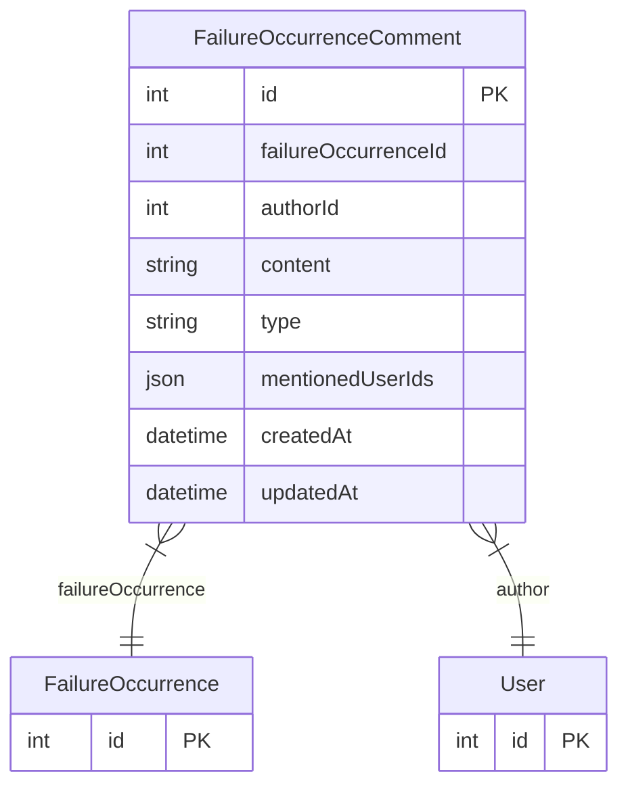

# FailureOccurrenceComment

> Table name: `failure_occurrence_comments`

**Schema location:** Lines 5695-5711

## Fields

| Field | Type | Required | Unique | Default | Notes |
|-------|------|----------|--------|---------|-------|
| `id` | `Int` | ✅ | 🔑 PK | `autoincrement(` |  |
| `failureOccurrenceId` | `Int` | ✅ |  | `` |  |
| `authorId` | `Int` | ✅ |  | `` |  |
| `content` | `String` | ✅ |  | `` | DB: Text |
| `type` | `String` | ✅ |  | `"comment"` | comment | system | mention |
| `mentionedUserIds` | `Json?` | ❌ |  | `` | Array de IDs de usuarios mencionados |
| `createdAt` | `DateTime` | ✅ |  | `now(` |  |
| `updatedAt` | `DateTime` | ✅ |  | `` |  |

## Relations

| Field | Type | Cardinality | FK Fields | References | On Delete |
|-------|------|-------------|-----------|------------|-----------|
| `failureOccurrence` | [FailureOccurrence](./models/FailureOccurrence.md) | Many-to-One | failureOccurrenceId | id | Cascade |
| `author` | [User](./models/User.md) | Many-to-One | authorId | id | - |

## Referenced By

| Model | Field | Cardinality |
|-------|-------|-------------|
| [User](./models/User.md) | `failureOccurrenceComments` | Has many |
| [FailureOccurrence](./models/FailureOccurrence.md) | `comments` | Has many |

## Indexes

- `failureOccurrenceId, createdAt`
- `authorId`

## Entity Diagram

