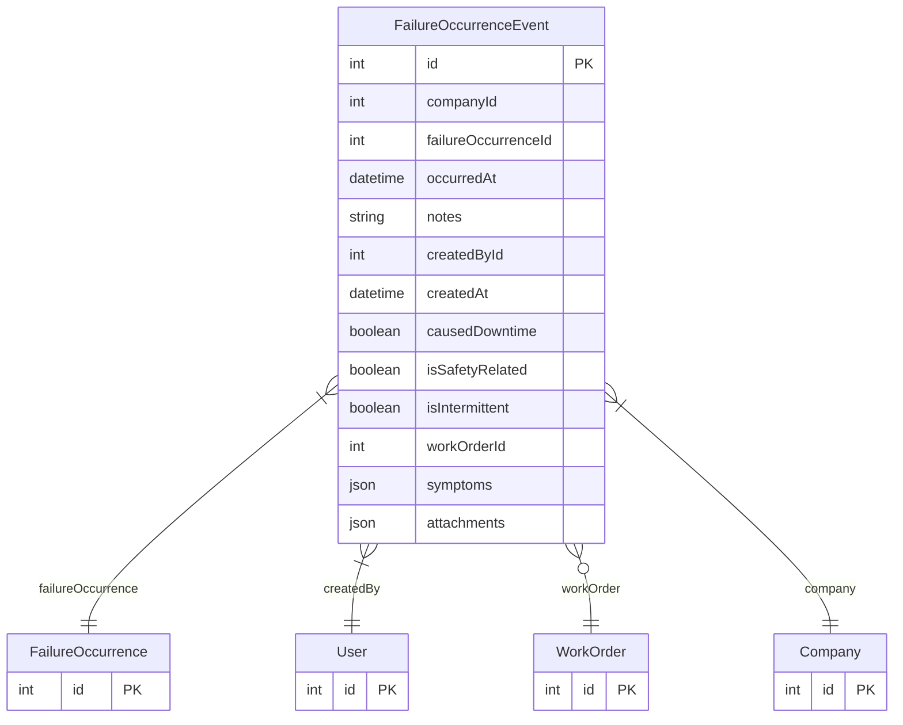

# FailureOccurrenceEvent

> Table name: `failure_occurrence_events`

**Schema location:** Lines 5817-5848

## Fields

| Field | Type | Required | Unique | Default | Notes |
|-------|------|----------|--------|---------|-------|
| `id` | `Int` | ✅ | 🔑 PK | `autoincrement(` |  |
| `companyId` | `Int` | ✅ |  | `` |  |
| `failureOccurrenceId` | `Int` | ✅ |  | `` |  |
| `occurredAt` | `DateTime` | ✅ |  | `now(` |  |
| `notes` | `String?` | ❌ |  | `` | DB: Text |
| `createdById` | `Int` | ✅ |  | `` |  |
| `createdAt` | `DateTime` | ✅ |  | `now(` |  |
| `causedDowntime` | `Boolean` | ✅ |  | `false` | Flags del evento |
| `isSafetyRelated` | `Boolean` | ✅ |  | `false` |  |
| `isIntermittent` | `Boolean` | ✅ |  | `false` |  |
| `workOrderId` | `Int?` | ❌ |  | `` | Si se creó OT desde este evento |
| `symptoms` | `Json?` | ❌ |  | `` | Array de IDs |
| `attachments` | `Json?` | ❌ |  | `` | Array de URLs |

## Relations

| Field | Type | Cardinality | FK Fields | References | On Delete |
|-------|------|-------------|-----------|------------|-----------|
| `failureOccurrence` | [FailureOccurrence](./models/FailureOccurrence.md) | Many-to-One | failureOccurrenceId | id | Cascade |
| `createdBy` | [User](./models/User.md) | Many-to-One | createdById | id | - |
| `workOrder` | [WorkOrder](./models/WorkOrder.md) | Many-to-One (optional) | workOrderId | id | - |
| `company` | [Company](./models/Company.md) | Many-to-One | companyId | id | Cascade |

## Referenced By

| Model | Field | Cardinality |
|-------|-------|-------------|
| [Company](./models/Company.md) | `occurrenceEvents` | Has many |
| [User](./models/User.md) | `occurrenceEventsCreated` | Has many |
| [WorkOrder](./models/WorkOrder.md) | `occurrenceEvents` | Has many |
| [FailureOccurrence](./models/FailureOccurrence.md) | `occurrenceEvents` | Has many |

## Indexes

- `companyId, failureOccurrenceId, occurredAt`
- `failureOccurrenceId, createdAt`
- `workOrderId`

## Entity Diagram

