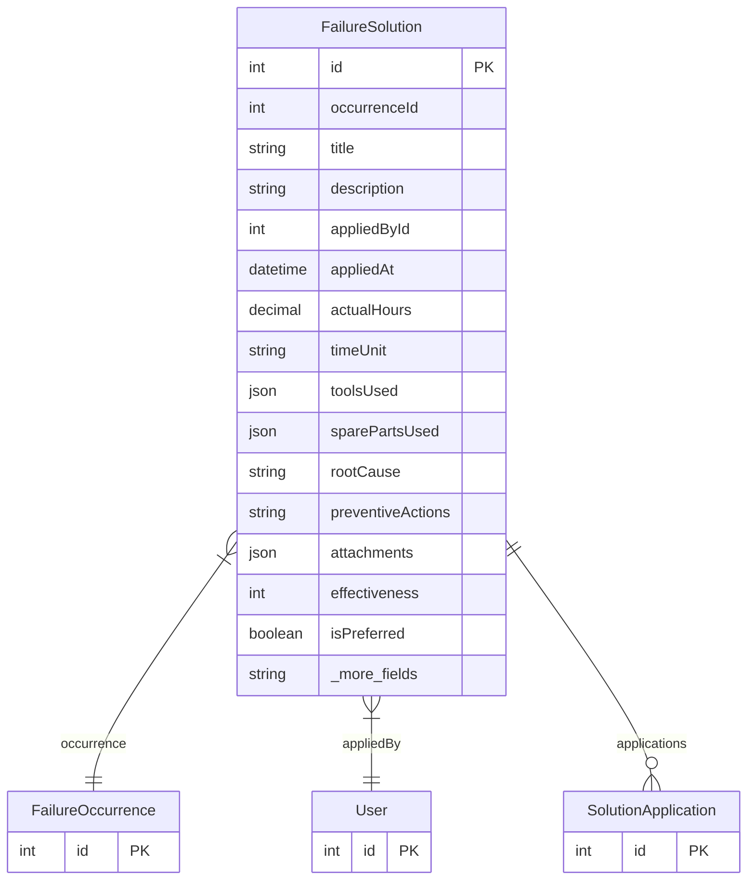

# FailureSolution

> Table name: `failure_solutions`

**Schema location:** Lines 1809-1837

## Fields

| Field | Type | Required | Unique | Default | Notes |
|-------|------|----------|--------|---------|-------|
| `id` | `Int` | ✅ | 🔑 PK | `autoincrement(` |  |
| `occurrenceId` | `Int` | ✅ |  | `` | Ocurrencia a la que pertenece |
| `title` | `String` | ✅ |  | `` | DB: VarChar(255) |
| `description` | `String` | ✅ |  | `` | Rich HTML de la solución |
| `appliedById` | `Int` | ✅ |  | `` | Usuario que aplicó la solución |
| `appliedAt` | `DateTime` | ✅ |  | `now(` |  |
| `actualHours` | `Decimal?` | ❌ |  | `` | DB: Decimal(5, 2) |
| `timeUnit` | `String` | ✅ |  | `"hours"` | DB: VarChar(20). hours, minutes |
| `toolsUsed` | `Json?` | ❌ |  | `` | Array de {id, name, quantity} |
| `sparePartsUsed` | `Json?` | ❌ |  | `` | Array de {id, name, quantity} |
| `rootCause` | `String?` | ❌ |  | `` | Causa raíz identificada |
| `preventiveActions` | `String?` | ❌ |  | `` | Acciones preventivas recomendadas |
| `attachments` | `Json?` | ❌ |  | `` | Archivos de documentación |
| `effectiveness` | `Int?` | ❌ |  | `` | Rating 1-5 de efectividad |
| `isPreferred` | `Boolean` | ✅ |  | `false` | Solución preferida/recomendada |
| `createdAt` | `DateTime` | ✅ |  | `now(` |  |
| `updatedAt` | `DateTime` | ✅ |  | `` |  |

## Relations

| Field | Type | Cardinality | FK Fields | References | On Delete |
|-------|------|-------------|-----------|------------|-----------|
| `occurrence` | [FailureOccurrence](./models/FailureOccurrence.md) | Many-to-One | occurrenceId | id | Cascade |
| `appliedBy` | [User](./models/User.md) | Many-to-One | appliedById | id | - |
| `applications` | [SolutionApplication](./models/SolutionApplication.md) | One-to-Many | - | - | - |

## Referenced By

| Model | Field | Cardinality |
|-------|-------|-------------|
| [User](./models/User.md) | `solutionsApplied` | Has many |
| [FailureOccurrence](./models/FailureOccurrence.md) | `solutions` | Has many |
| [SolutionApplication](./models/SolutionApplication.md) | `failureSolution` | Has one |

## Indexes

- `occurrenceId`
- `appliedById`
- `isPreferred`

## Entity Diagram

