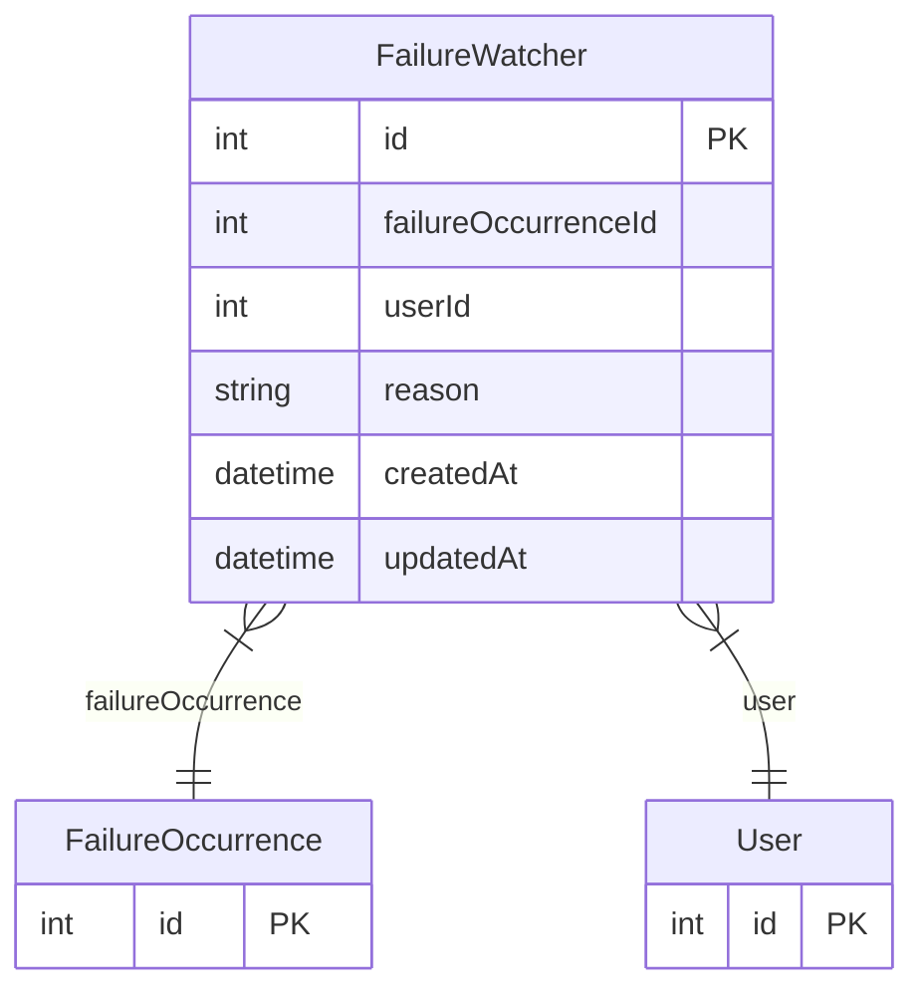

# FailureWatcher

> Table name: `failure_watchers`

**Schema location:** Lines 5661-5675

## Fields

| Field | Type | Required | Unique | Default | Notes |
|-------|------|----------|--------|---------|-------|
| `id` | `Int` | ✅ | 🔑 PK | `autoincrement(` |  |
| `failureOccurrenceId` | `Int` | ✅ |  | `` |  |
| `userId` | `Int` | ✅ |  | `` |  |
| `reason` | `String?` | ❌ |  | `` |  |
| `createdAt` | `DateTime` | ✅ |  | `now(` |  |
| `updatedAt` | `DateTime` | ✅ |  | `` |  |

## Relations

| Field | Type | Cardinality | FK Fields | References | On Delete |
|-------|------|-------------|-----------|------------|-----------|
| `failureOccurrence` | [FailureOccurrence](./models/FailureOccurrence.md) | Many-to-One | failureOccurrenceId | id | Cascade |
| `user` | [User](./models/User.md) | Many-to-One | userId | id | - |

## Referenced By

| Model | Field | Cardinality |
|-------|-------|-------------|
| [User](./models/User.md) | `failureWatchers` | Has many |
| [FailureOccurrence](./models/FailureOccurrence.md) | `watchers` | Has many |

## Indexes

- `userId`

## Unique Constraints

- `failureOccurrenceId, userId`

## Entity Diagram

