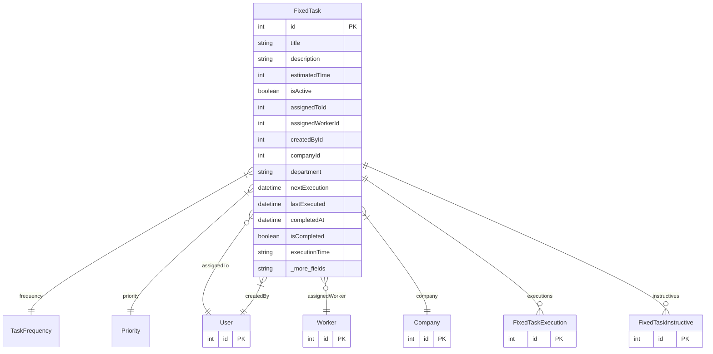

# FixedTask

> Table name: `FixedTask`

**Schema location:** Lines 1964-1992

## Fields

| Field | Type | Required | Unique | Default | Notes |
|-------|------|----------|--------|---------|-------|
| `id` | `Int` | ✅ | 🔑 PK | `autoincrement(` |  |
| `title` | `String` | ✅ |  | `` |  |
| `description` | `String?` | ❌ |  | `` |  |
| `estimatedTime` | `Int?` | ❌ |  | `` |  |
| `isActive` | `Boolean` | ✅ |  | `true` |  |
| `assignedToId` | `Int?` | ❌ |  | `` |  |
| `assignedWorkerId` | `Int?` | ❌ |  | `` |  |
| `createdById` | `Int` | ✅ |  | `` |  |
| `companyId` | `Int` | ✅ |  | `` |  |
| `department` | `String?` | ❌ |  | `` |  |
| `nextExecution` | `DateTime` | ✅ |  | `` |  |
| `lastExecuted` | `DateTime?` | ❌ |  | `` |  |
| `completedAt` | `DateTime?` | ❌ |  | `` |  |
| `isCompleted` | `Boolean` | ✅ |  | `false` |  |
| `executionTime` | `String?` | ❌ |  | `` |  |
| `createdAt` | `DateTime` | ✅ |  | `now(` |  |
| `updatedAt` | `DateTime` | ✅ |  | `` |  |

## Relations

| Field | Type | Cardinality | FK Fields | References | On Delete |
|-------|------|-------------|-----------|------------|-----------|
| `frequency` | [TaskFrequency](./models/TaskFrequency.md) | Many-to-One | - | - | - |
| `priority` | [Priority](./models/Priority.md) | Many-to-One | - | - | - |
| `assignedTo` | [User](./models/User.md) | Many-to-One (optional) | assignedToId | id | - |
| `assignedWorker` | [Worker](./models/Worker.md) | Many-to-One (optional) | assignedWorkerId | id | - |
| `company` | [Company](./models/Company.md) | Many-to-One | companyId | id | Cascade |
| `createdBy` | [User](./models/User.md) | Many-to-One | createdById | id | - |
| `executions` | [FixedTaskExecution](./models/FixedTaskExecution.md) | One-to-Many | - | - | - |
| `instructives` | [FixedTaskInstructive](./models/FixedTaskInstructive.md) | One-to-Many | - | - | - |

## Referenced By

| Model | Field | Cardinality |
|-------|-------|-------------|
| [Company](./models/Company.md) | `fixedTasks` | Has many |
| [User](./models/User.md) | `assignedFixedTasks` | Has many |
| [User](./models/User.md) | `createdFixedTasks` | Has many |
| [Worker](./models/Worker.md) | `assignedFixedTasks` | Has many |
| [FixedTaskInstructive](./models/FixedTaskInstructive.md) | `fixedTask` | Has one |
| [FixedTaskExecution](./models/FixedTaskExecution.md) | `fixedTask` | Has one |

## Entity Diagram

