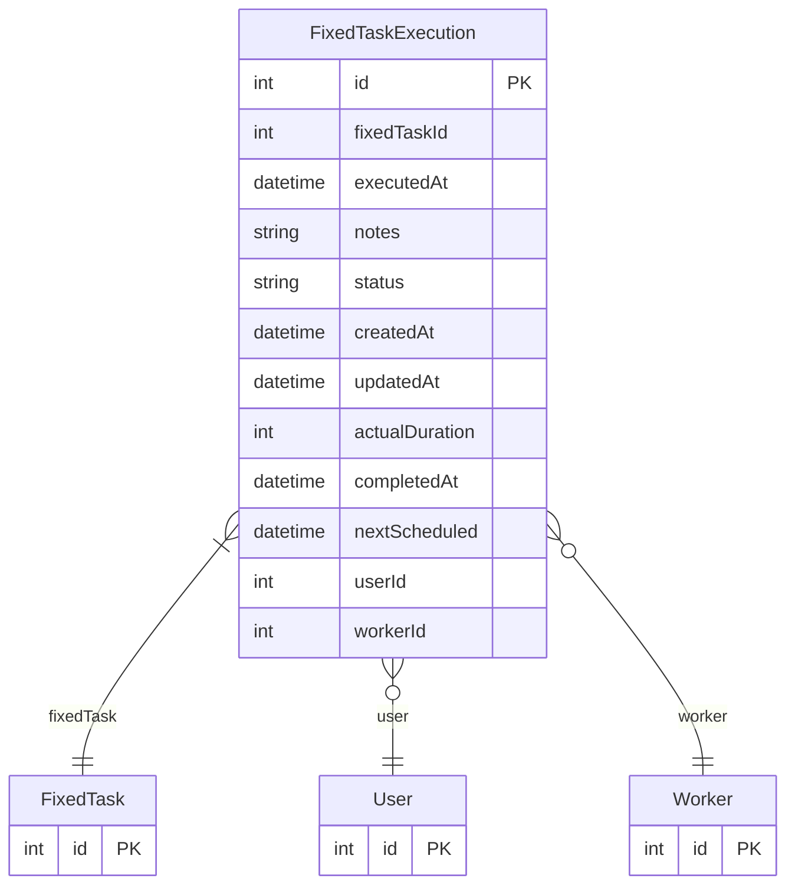

# FixedTaskExecution

> Table name: `FixedTaskExecution`

**Schema location:** Lines 2008-2026

## Fields

| Field | Type | Required | Unique | Default | Notes |
|-------|------|----------|--------|---------|-------|
| `id` | `Int` | ✅ | 🔑 PK | `autoincrement(` |  |
| `fixedTaskId` | `Int` | ✅ |  | `` |  |
| `executedAt` | `DateTime` | ✅ |  | `now(` |  |
| `notes` | `String?` | ❌ |  | `` |  |
| `status` | `String` | ✅ |  | `"PENDING"` |  |
| `createdAt` | `DateTime` | ✅ |  | `now(` |  |
| `updatedAt` | `DateTime` | ✅ |  | `` |  |
| `actualDuration` | `Int?` | ❌ |  | `` |  |
| `completedAt` | `DateTime?` | ❌ |  | `` |  |
| `nextScheduled` | `DateTime?` | ❌ |  | `` |  |
| `userId` | `Int?` | ❌ |  | `` |  |
| `workerId` | `Int?` | ❌ |  | `` |  |

## Relations

| Field | Type | Cardinality | FK Fields | References | On Delete |
|-------|------|-------------|-----------|------------|-----------|
| `fixedTask` | [FixedTask](./models/FixedTask.md) | Many-to-One | fixedTaskId | id | Cascade |
| `user` | [User](./models/User.md) | Many-to-One (optional) | userId | id | - |
| `worker` | [Worker](./models/Worker.md) | Many-to-One (optional) | workerId | id | - |

## Referenced By

| Model | Field | Cardinality |
|-------|-------|-------------|
| [User](./models/User.md) | `fixedTaskExecutions` | Has many |
| [Worker](./models/Worker.md) | `fixedTaskExecutions` | Has many |
| [FixedTask](./models/FixedTask.md) | `executions` | Has many |

## Entity Diagram

