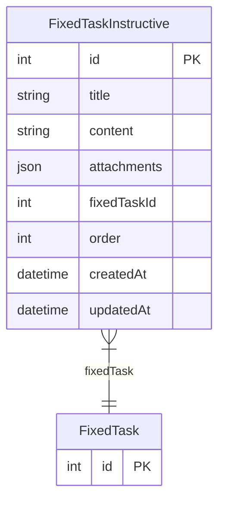

# FixedTaskInstructive

> Table name: `FixedTaskInstructive`

**Schema location:** Lines 1994-2006

## Fields

| Field | Type | Required | Unique | Default | Notes |
|-------|------|----------|--------|---------|-------|
| `id` | `Int` | ✅ | 🔑 PK | `autoincrement(` |  |
| `title` | `String` | ✅ |  | `` |  |
| `content` | `String` | ✅ |  | `` |  |
| `attachments` | `Json?` | ❌ |  | `` |  |
| `fixedTaskId` | `Int` | ✅ |  | `` |  |
| `order` | `Int` | ✅ |  | `0` |  |
| `createdAt` | `DateTime` | ✅ |  | `now(` |  |
| `updatedAt` | `DateTime` | ✅ |  | `` |  |

## Relations

| Field | Type | Cardinality | FK Fields | References | On Delete |
|-------|------|-------------|-----------|------------|-----------|
| `fixedTask` | [FixedTask](./models/FixedTask.md) | Many-to-One | fixedTaskId | id | Cascade |

## Referenced By

| Model | Field | Cardinality |
|-------|-------|-------------|
| [FixedTask](./models/FixedTask.md) | `instructives` | Has many |

## Entity Diagram

