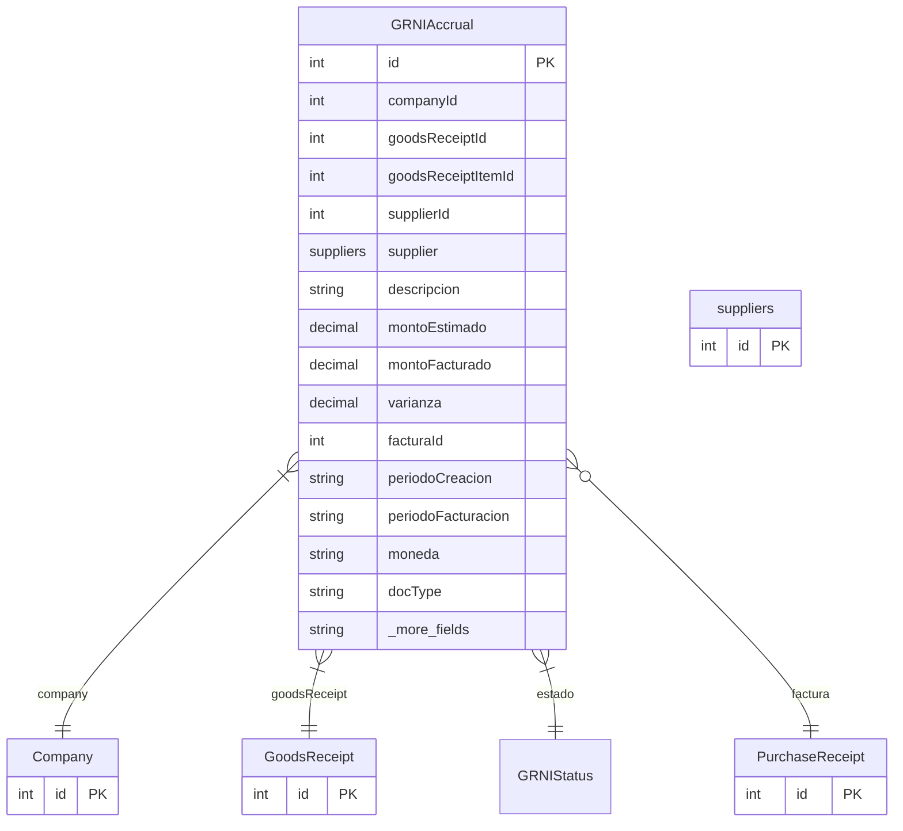

# GRNIAccrual

> Table name: `grni_accruals`

**Schema location:** Lines 6602-6653

## Fields

| Field | Type | Required | Unique | Default | Notes |
|-------|------|----------|--------|---------|-------|
| `id` | `Int` | ✅ | 🔑 PK | `autoincrement(` |  |
| `companyId` | `Int` | ✅ |  | `` |  |
| `goodsReceiptId` | `Int` | ✅ |  | `` | Origen |
| `goodsReceiptItemId` | `Int?` | ❌ |  | `` |  |
| `supplierId` | `Int` | ✅ |  | `` | Proveedor |
| `supplier` | `suppliers` | ✅ |  | `` |  |
| `descripcion` | `String?` | ❌ |  | `` | Descripción del item |
| `montoEstimado` | `Decimal` | ✅ |  | `` | DB: Decimal(15, 2). Precio OC * cantidad recibida |
| `montoFacturado` | `Decimal?` | ❌ |  | `` | DB: Decimal(15, 2). Cuando llega factura |
| `varianza` | `Decimal?` | ❌ |  | `` | DB: Decimal(15, 2). montoFacturado - montoEstimado |
| `facturaId` | `Int?` | ❌ |  | `` | Factura (cuando llega) |
| `periodoCreacion` | `String` | ✅ |  | `` | "2026-01" formato YYYY-MM |
| `periodoFacturacion` | `String?` | ❌ |  | `` | Cuando se factura |
| `moneda` | `String` | ✅ |  | `"ARS"` | Moneda |
| `docType` | `String` | ✅ |  | `"T1"` | T1/T2 |
| `createdAt` | `DateTime` | ✅ |  | `now(` | Audit |
| `createdBy` | `Int?` | ❌ |  | `` |  |
| `reversadoAt` | `DateTime?` | ❌ |  | `` |  |
| `reversadoBy` | `Int?` | ❌ |  | `` |  |
| `motivoReversion` | `String?` | ❌ |  | `` |  |

## Relations

| Field | Type | Cardinality | FK Fields | References | On Delete |
|-------|------|-------------|-----------|------------|-----------|
| `company` | [Company](./models/Company.md) | Many-to-One | companyId | id | Cascade |
| `goodsReceipt` | [GoodsReceipt](./models/GoodsReceipt.md) | Many-to-One | goodsReceiptId | id | Cascade |
| `estado` | [GRNIStatus](./models/GRNIStatus.md) | Many-to-One | - | - | - |
| `factura` | [PurchaseReceipt](./models/PurchaseReceipt.md) | Many-to-One (optional) | facturaId | id | - |

## Referenced By

| Model | Field | Cardinality |
|-------|-------|-------------|
| [Company](./models/Company.md) | `grniAccruals` | Has many |
| [suppliers](./models/suppliers.md) | `grniAccruals` | Has many |
| [PurchaseReceipt](./models/PurchaseReceipt.md) | `grniAccruals` | Has many |
| [GoodsReceipt](./models/GoodsReceipt.md) | `grniAccruals` | Has many |

## Indexes

- `companyId, estado`
- `supplierId`
- `periodoCreacion`
- `goodsReceiptId`

## Entity Diagram

