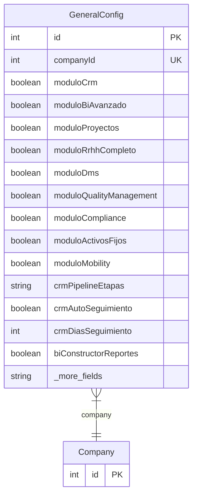

# GeneralConfig

> Table name: `general_config`

**Schema location:** Lines 15284-15330

## Fields

| Field | Type | Required | Unique | Default | Notes |
|-------|------|----------|--------|---------|-------|
| `id` | `Int` | ✅ | 🔑 PK | `autoincrement(` |  |
| `companyId` | `Int` | ✅ | ✅ | `` |  |
| `moduloCrm` | `Boolean` | ✅ |  | `false` | Módulos habilitados |
| `moduloBiAvanzado` | `Boolean` | ✅ |  | `false` |  |
| `moduloProyectos` | `Boolean` | ✅ |  | `false` |  |
| `moduloRrhhCompleto` | `Boolean` | ✅ |  | `false` |  |
| `moduloDms` | `Boolean` | ✅ |  | `false` |  |
| `moduloQualityManagement` | `Boolean` | ✅ |  | `false` |  |
| `moduloCompliance` | `Boolean` | ✅ |  | `false` |  |
| `moduloActivosFijos` | `Boolean` | ✅ |  | `false` |  |
| `moduloMobility` | `Boolean` | ✅ |  | `false` |  |
| `crmPipelineEtapas` | `String?` | ❌ |  | `` | Configuración CRM |
| `crmAutoSeguimiento` | `Boolean` | ✅ |  | `false` |  |
| `crmDiasSeguimiento` | `Int` | ✅ |  | `7` |  |
| `biConstructorReportes` | `Boolean` | ✅ |  | `false` | Configuración BI |
| `biAlertasAutomaticas` | `Boolean` | ✅ |  | `false` |  |
| `biReportesProgramados` | `Boolean` | ✅ |  | `false` |  |
| `proyectosTimeTracking` | `Boolean` | ✅ |  | `false` | Configuración Proyectos |
| `proyectosFacturacion` | `Boolean` | ✅ |  | `false` |  |
| `proyectosRequiereAprobacionPresupuesto` | `Boolean` | ✅ |  | `true` |  |
| `qualityIso9001` | `Boolean` | ✅ |  | `false` | Configuración Quality |
| `qualityAutoNcr` | `Boolean` | ✅ |  | `false` |  |
| `qualityRequiereCapa` | `Boolean` | ✅ |  | `true` |  |
| `rrhhPortalEmpleado` | `Boolean` | ✅ |  | `false` | Configuración RRHH |
| `rrhhEvaluacionesDesempeno` | `Boolean` | ✅ |  | `false` |  |
| `rrhhGestionVacaciones` | `Boolean` | ✅ |  | `false` |  |
| `createdAt` | `DateTime` | ✅ |  | `now(` |  |
| `updatedAt` | `DateTime` | ✅ |  | `` |  |

## Relations

| Field | Type | Cardinality | FK Fields | References | On Delete |
|-------|------|-------------|-----------|------------|-----------|
| `company` | [Company](./models/Company.md) | Many-to-One | companyId | id | Cascade |

## Referenced By

| Model | Field | Cardinality |
|-------|-------|-------------|
| [Company](./models/Company.md) | `generalConfig` | Has one |

## Entity Diagram

