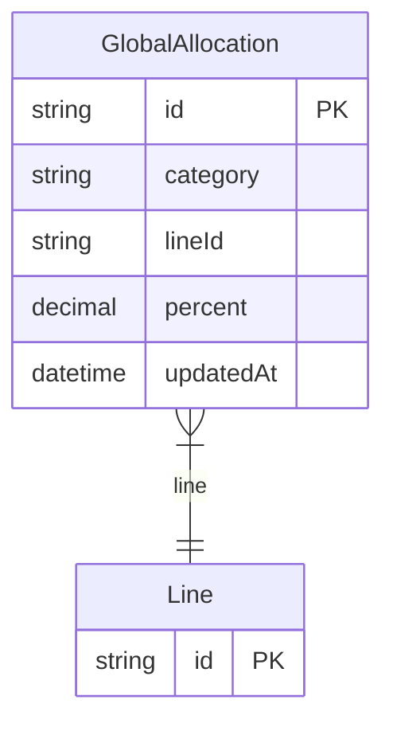

# GlobalAllocation

> Table name: `GlobalAllocation`

**Schema location:** Lines 2768-2778

## Fields

| Field | Type | Required | Unique | Default | Notes |
|-------|------|----------|--------|---------|-------|
| `id` | `String` | ✅ | 🔑 PK | `uuid(` |  |
| `category` | `String` | ✅ |  | `` |  |
| `lineId` | `String` | ✅ |  | `` |  |
| `percent` | `Decimal` | ✅ |  | `` | DB: Decimal(5, 4) |
| `updatedAt` | `DateTime` | ✅ |  | `` |  |

## Relations

| Field | Type | Cardinality | FK Fields | References | On Delete |
|-------|------|-------------|-----------|------------|-----------|
| `line` | [Line](./models/Line.md) | Many-to-One | lineId | id | Cascade |

## Referenced By

| Model | Field | Cardinality |
|-------|-------|-------------|
| [Line](./models/Line.md) | `globalAllocations` | Has many |

## Unique Constraints

- `category, lineId`

## Entity Diagram

