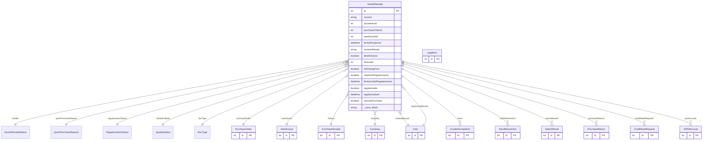

# GoodsReceipt

> Table name: `goods_receipts`

**Schema location:** Lines 6489-6554

## Fields

| Field | Type | Required | Unique | Default | Notes |
|-------|------|----------|--------|---------|-------|
| `id` | `Int` | ✅ | 🔑 PK | `autoincrement(` |  |
| `numero` | `String` | ✅ |  | `` | DB: VarChar(50) |
| `proveedorId` | `Int` | ✅ |  | `` |  |
| `purchaseOrderId` | `Int?` | ❌ |  | `` | Puede ser recepción sin OC |
| `warehouseId` | `Int` | ✅ |  | `` |  |
| `fechaRecepcion` | `DateTime` | ✅ |  | `` | DB: Date |
| `numeroRemito` | `String?` | ❌ |  | `` | DB: VarChar(100). Número del remito del proveedor |
| `tieneFactura` | `Boolean` | ✅ |  | `false` | Control de documentación |
| `facturaId` | `Int?` | ❌ |  | `` | Vinculación con factura cuando exista |
| `esEmergencia` | `Boolean` | ✅ |  | `false` | Campos de emergencia/regularización |
| `requiereRegularizacion` | `Boolean` | ✅ |  | `false` |  |
| `fechaLimiteRegularizacion` | `DateTime?` | ❌ |  | `` |  |
| `regularizada` | `Boolean` | ✅ |  | `false` |  |
| `regularizadaAt` | `DateTime?` | ❌ |  | `` |  |
| `isQuickPurchase` | `Boolean` | ✅ |  | `false` | Compra Rápida (sin OC) |
| `quickPurchaseJustification` | `String?` | ❌ |  | `` |  |
| `regularizedBy` | `Int?` | ❌ |  | `` |  |
| `regularizationNotes` | `String?` | ❌ |  | `` |  |
| `notasCalidad` | `String?` | ❌ |  | `` |  |
| `notas` | `String?` | ❌ |  | `` | Tracking |
| `adjuntos` | `String[]` | ✅ |  | `` | URLs a S3 (fotos remito firmado, mercadería) |
| `firma` | `String?` | ❌ |  | `` | Firma digital en base64 o URL a imagen |
| `observacionesRecepcion` | `String?` | ❌ |  | `` | Observaciones sobre estado de la mercadería |
| `companyId` | `Int` | ✅ |  | `` |  |
| `createdBy` | `Int` | ✅ |  | `` |  |
| `createdAt` | `DateTime` | ✅ |  | `now(` |  |
| `updatedAt` | `DateTime` | ✅ |  | `` |  |
| `proveedor` | `suppliers` | ✅ |  | `` |  |

## Relations

| Field | Type | Cardinality | FK Fields | References | On Delete |
|-------|------|-------------|-----------|------------|-----------|
| `estado` | [GoodsReceiptStatus](./models/GoodsReceiptStatus.md) | Many-to-One | - | - | - |
| `quickPurchaseReason` | [QuickPurchaseReason](./models/QuickPurchaseReason.md) | Many-to-One (optional) | - | - | - |
| `regularizationStatus` | [RegularizationStatus](./models/RegularizationStatus.md) | Many-to-One (optional) | - | - | - |
| `estadoCalidad` | [QualityStatus](./models/QualityStatus.md) | Many-to-One | - | - | - |
| `docType` | [DocType](./models/DocType.md) | Many-to-One | - | - | - |
| `purchaseOrder` | [PurchaseOrder](./models/PurchaseOrder.md) | Many-to-One (optional) | purchaseOrderId | id | - |
| `warehouse` | [Warehouse](./models/Warehouse.md) | Many-to-One | warehouseId | id | - |
| `factura` | [PurchaseReceipt](./models/PurchaseReceipt.md) | Many-to-One (optional) | facturaId | id | - |
| `company` | [Company](./models/Company.md) | Many-to-One | companyId | id | Cascade |
| `createdByUser` | [User](./models/User.md) | Many-to-One | createdBy | id | - |
| `items` | [GoodsReceiptItem](./models/GoodsReceiptItem.md) | One-to-Many | - | - | - |
| `stockMovements` | [StockMovement](./models/StockMovement.md) | One-to-Many | - | - | - |
| `matchResults` | [MatchResult](./models/MatchResult.md) | One-to-Many | - | - | - |
| `purchaseReturns` | [PurchaseReturn](./models/PurchaseReturn.md) | One-to-Many | - | - | - |
| `creditNoteRequests` | [CreditNoteRequest](./models/CreditNoteRequest.md) | One-to-Many | - | - | - |
| `regularizedByUser` | [User](./models/User.md) | Many-to-One (optional) | regularizedBy | id | - |
| `grniAccruals` | [GRNIAccrual](./models/GRNIAccrual.md) | One-to-Many | - | - | - |

## Referenced By

| Model | Field | Cardinality |
|-------|-------|-------------|
| [Company](./models/Company.md) | `goodsReceipts` | Has many |
| [User](./models/User.md) | `goodsReceiptsCreated` | Has many |
| [User](./models/User.md) | `goodsReceiptsRegularized` | Has many |
| [suppliers](./models/suppliers.md) | `goodsReceipts` | Has many |
| [PurchaseReceipt](./models/PurchaseReceipt.md) | `goodsReceipts` | Has many |
| [Warehouse](./models/Warehouse.md) | `goodsReceipts` | Has many |
| [StockMovement](./models/StockMovement.md) | `goodsReceipt` | Has one |
| [PurchaseOrder](./models/PurchaseOrder.md) | `goodsReceipts` | Has many |
| [GoodsReceiptItem](./models/GoodsReceiptItem.md) | `goodsReceipt` | Has one |
| [GRNIAccrual](./models/GRNIAccrual.md) | `goodsReceipt` | Has one |
| [CreditNoteRequest](./models/CreditNoteRequest.md) | `goodsReceipt` | Has one |
| [MatchResult](./models/MatchResult.md) | `goodsReceipt` | Has one |
| [PurchaseReturn](./models/PurchaseReturn.md) | `goodsReceipt` | Has one |

## Indexes

- `companyId`
- `proveedorId`
- `purchaseOrderId`
- `estado`
- `fechaRecepcion`
- `requiereRegularizacion, regularizada`
- `docType`
- `companyId, docType`

## Unique Constraints

- `companyId, numero`

## Entity Diagram

