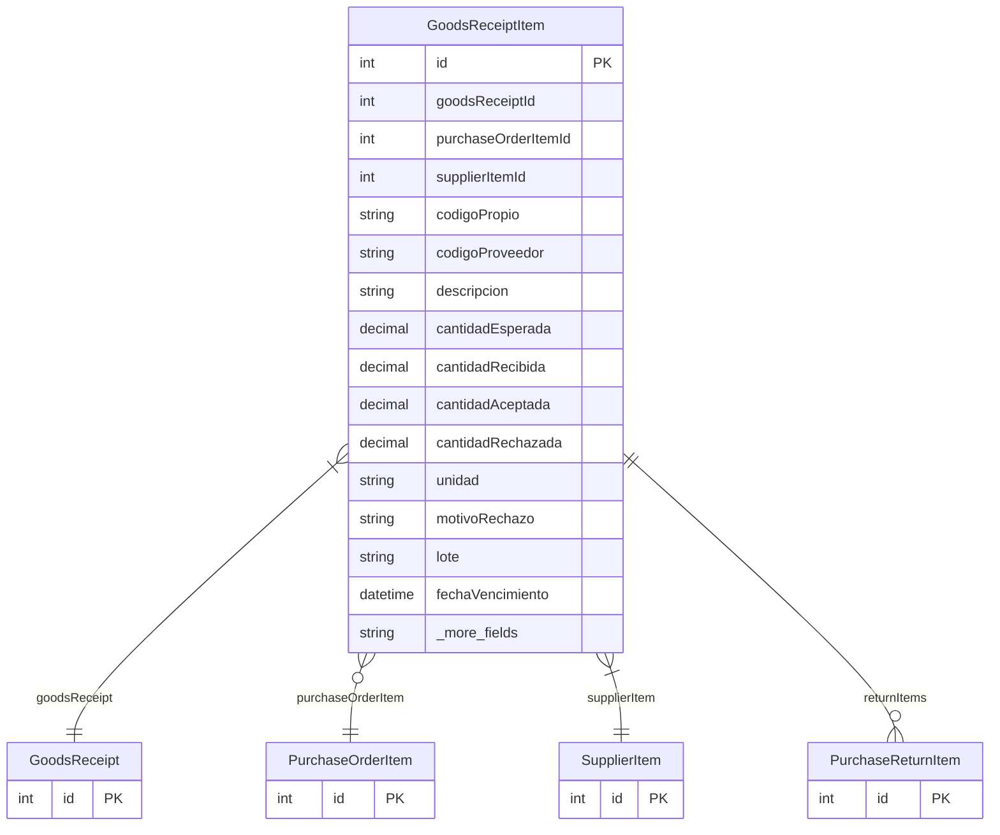

# GoodsReceiptItem

> Table name: `goods_receipt_items`

**Schema location:** Lines 6556-6583

## Fields

| Field | Type | Required | Unique | Default | Notes |
|-------|------|----------|--------|---------|-------|
| `id` | `Int` | ✅ | 🔑 PK | `autoincrement(` |  |
| `goodsReceiptId` | `Int` | ✅ |  | `` |  |
| `purchaseOrderItemId` | `Int?` | ❌ |  | `` | Si viene de una OC |
| `supplierItemId` | `Int` | ✅ |  | `` |  |
| `codigoPropio` | `String?` | ❌ |  | `` | DB: VarChar(100). Código interno usado en la OC |
| `codigoProveedor` | `String?` | ❌ |  | `` | DB: VarChar(100). Código del proveedor usado en la OC |
| `descripcion` | `String` | ✅ |  | `` | DB: VarChar(255) |
| `cantidadEsperada` | `Decimal?` | ❌ |  | `` | DB: Decimal(15, 4). De la OC |
| `cantidadRecibida` | `Decimal` | ✅ |  | `` | DB: Decimal(15, 4) |
| `cantidadAceptada` | `Decimal` | ✅ |  | `` | DB: Decimal(15, 4) |
| `cantidadRechazada` | `Decimal` | ✅ |  | `0` | DB: Decimal(15, 4) |
| `unidad` | `String` | ✅ |  | `` | DB: VarChar(50) |
| `motivoRechazo` | `String?` | ❌ |  | `` |  |
| `lote` | `String?` | ❌ |  | `` | DB: VarChar(100) |
| `fechaVencimiento` | `DateTime?` | ❌ |  | `` | DB: Date |
| `notas` | `String?` | ❌ |  | `` |  |

## Relations

| Field | Type | Cardinality | FK Fields | References | On Delete |
|-------|------|-------------|-----------|------------|-----------|
| `goodsReceipt` | [GoodsReceipt](./models/GoodsReceipt.md) | Many-to-One | goodsReceiptId | id | Cascade |
| `purchaseOrderItem` | [PurchaseOrderItem](./models/PurchaseOrderItem.md) | Many-to-One (optional) | purchaseOrderItemId | id | - |
| `supplierItem` | [SupplierItem](./models/SupplierItem.md) | Many-to-One | supplierItemId | id | - |
| `returnItems` | [PurchaseReturnItem](./models/PurchaseReturnItem.md) | One-to-Many | - | - | - |

## Referenced By

| Model | Field | Cardinality |
|-------|-------|-------------|
| [SupplierItem](./models/SupplierItem.md) | `goodsReceiptItems` | Has many |
| [PurchaseOrderItem](./models/PurchaseOrderItem.md) | `receiptItems` | Has many |
| [GoodsReceipt](./models/GoodsReceipt.md) | `items` | Has many |
| [PurchaseReturnItem](./models/PurchaseReturnItem.md) | `goodsReceiptItem` | Has one |

## Indexes

- `goodsReceiptId`
- `purchaseOrderItemId`
- `supplierItemId`

## Entity Diagram

