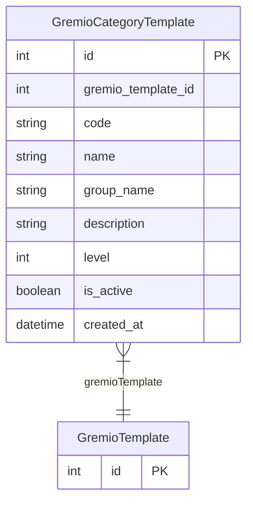

# GremioCategoryTemplate

> Table name: `gremio_category_templates`

**Schema location:** Lines 11969-11984

## Fields

| Field | Type | Required | Unique | Default | Notes |
|-------|------|----------|--------|---------|-------|
| `id` | `Int` | ✅ | 🔑 PK | `autoincrement(` |  |
| `gremio_template_id` | `Int` | ✅ |  | `` |  |
| `code` | `String?` | ❌ |  | `` | DB: VarChar(50) |
| `name` | `String` | ✅ |  | `` | DB: VarChar(255) |
| `group_name` | `String?` | ❌ |  | `` | DB: VarChar(100) |
| `description` | `String?` | ❌ |  | `` |  |
| `level` | `Int` | ✅ |  | `0` |  |
| `is_active` | `Boolean` | ✅ |  | `true` |  |
| `created_at` | `DateTime` | ✅ |  | `now(` |  |

## Relations

| Field | Type | Cardinality | FK Fields | References | On Delete |
|-------|------|-------------|-----------|------------|-----------|
| `gremioTemplate` | [GremioTemplate](./models/GremioTemplate.md) | Many-to-One | gremio_template_id | id | Cascade |

## Referenced By

| Model | Field | Cardinality |
|-------|-------|-------------|
| [GremioTemplate](./models/GremioTemplate.md) | `categories` | Has many |

## Indexes

- `gremio_template_id`

## Entity Diagram

