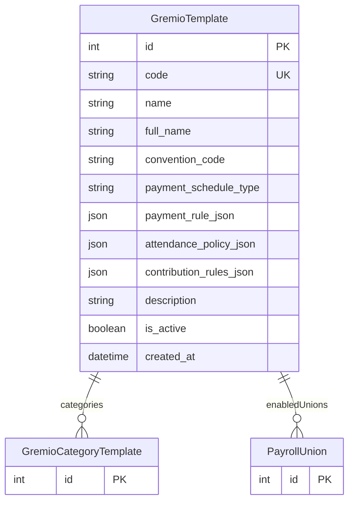

# GremioTemplate

> Table name: `gremio_templates`

**Schema location:** Lines 11948-11966

## Fields

| Field | Type | Required | Unique | Default | Notes |
|-------|------|----------|--------|---------|-------|
| `id` | `Int` | ✅ | 🔑 PK | `autoincrement(` |  |
| `code` | `String` | ✅ | ✅ | `` | DB: VarChar(50) |
| `name` | `String` | ✅ |  | `` | DB: VarChar(255) |
| `full_name` | `String?` | ❌ |  | `` | DB: VarChar(500) |
| `convention_code` | `String?` | ❌ |  | `` | DB: VarChar(50) |
| `payment_schedule_type` | `String` | ✅ |  | `"BIWEEKLY_FIXED"` | DB: VarChar(50) |
| `payment_rule_json` | `Json?` | ❌ |  | `` |  |
| `attendance_policy_json` | `Json?` | ❌ |  | `` |  |
| `contribution_rules_json` | `Json?` | ❌ |  | `` |  |
| `description` | `String?` | ❌ |  | `` |  |
| `is_active` | `Boolean` | ✅ |  | `true` |  |
| `created_at` | `DateTime` | ✅ |  | `now(` |  |

## Relations

| Field | Type | Cardinality | FK Fields | References | On Delete |
|-------|------|-------------|-----------|------------|-----------|
| `categories` | [GremioCategoryTemplate](./models/GremioCategoryTemplate.md) | One-to-Many | - | - | - |
| `enabledUnions` | [PayrollUnion](./models/PayrollUnion.md) | One-to-Many | - | - | - |

## Referenced By

| Model | Field | Cardinality |
|-------|-------|-------------|
| [GremioCategoryTemplate](./models/GremioCategoryTemplate.md) | `gremioTemplate` | Has one |
| [PayrollUnion](./models/PayrollUnion.md) | `sourceTemplate` | Has one |

## Entity Diagram

