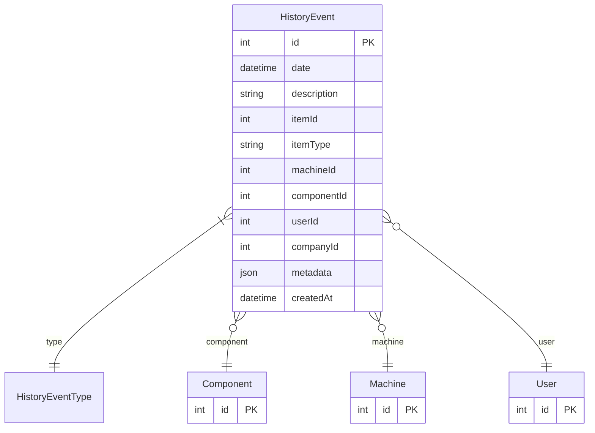

# HistoryEvent

> Table name: `HistoryEvent`

**Schema location:** Lines 2061-2079

## Fields

| Field | Type | Required | Unique | Default | Notes |
|-------|------|----------|--------|---------|-------|
| `id` | `Int` | ✅ | 🔑 PK | `autoincrement(` |  |
| `date` | `DateTime` | ✅ |  | `now(` |  |
| `description` | `String` | ✅ |  | `` |  |
| `itemId` | `Int` | ✅ |  | `` |  |
| `itemType` | `String` | ✅ |  | `` |  |
| `machineId` | `Int?` | ❌ |  | `` |  |
| `componentId` | `Int?` | ❌ |  | `` |  |
| `userId` | `Int?` | ❌ |  | `` |  |
| `companyId` | `Int?` | ❌ |  | `` |  |
| `metadata` | `Json?` | ❌ |  | `` |  |
| `createdAt` | `DateTime` | ✅ |  | `now(` |  |

## Relations

| Field | Type | Cardinality | FK Fields | References | On Delete |
|-------|------|-------------|-----------|------------|-----------|
| `type` | [HistoryEventType](./models/HistoryEventType.md) | Many-to-One | - | - | - |
| `component` | [Component](./models/Component.md) | Many-to-One (optional) | componentId | id | - |
| `machine` | [Machine](./models/Machine.md) | Many-to-One (optional) | machineId | id | - |
| `user` | [User](./models/User.md) | Many-to-One (optional) | userId | id | - |

## Referenced By

| Model | Field | Cardinality |
|-------|-------|-------------|
| [User](./models/User.md) | `historyEvents` | Has many |
| [Machine](./models/Machine.md) | `historyEvents` | Has many |
| [Component](./models/Component.md) | `historyEvents` | Has many |

## Entity Diagram

