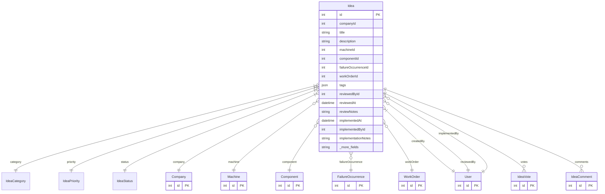

# Idea

> Table name: `ideas`

**Schema location:** Lines 12599-12652

## Fields

| Field | Type | Required | Unique | Default | Notes |
|-------|------|----------|--------|---------|-------|
| `id` | `Int` | ✅ | 🔑 PK | `autoincrement(` |  |
| `companyId` | `Int` | ✅ |  | `` |  |
| `title` | `String` | ✅ |  | `` |  |
| `description` | `String` | ✅ |  | `` | DB: Text |
| `machineId` | `Int?` | ❌ |  | `` | Vinculación opcional a entidades relacionadas |
| `componentId` | `Int?` | ❌ |  | `` |  |
| `failureOccurrenceId` | `Int?` | ❌ |  | `` | Vinculación a falla específica |
| `workOrderId` | `Int?` | ❌ |  | `` | Vinculación a OT específica |
| `tags` | `Json?` | ❌ |  | `` | Tags adicionales |
| `reviewedById` | `Int?` | ❌ |  | `` |  |
| `reviewedAt` | `DateTime?` | ❌ |  | `` |  |
| `reviewNotes` | `String?` | ❌ |  | `` | DB: Text |
| `implementedAt` | `DateTime?` | ❌ |  | `` | Implementación |
| `implementedById` | `Int?` | ❌ |  | `` |  |
| `implementationNotes` | `String?` | ❌ |  | `` | DB: Text |
| `createdById` | `Int` | ✅ |  | `` | Metadata |
| `createdAt` | `DateTime` | ✅ |  | `now(` |  |
| `updatedAt` | `DateTime` | ✅ |  | `` |  |
| `attachments` | `Json?` | ❌ |  | `` | [{url, name, type, size}] |

## Relations

| Field | Type | Cardinality | FK Fields | References | On Delete |
|-------|------|-------------|-----------|------------|-----------|
| `category` | [IdeaCategory](./models/IdeaCategory.md) | Many-to-One | - | - | - |
| `priority` | [IdeaPriority](./models/IdeaPriority.md) | Many-to-One | - | - | - |
| `status` | [IdeaStatus](./models/IdeaStatus.md) | Many-to-One | - | - | - |
| `company` | [Company](./models/Company.md) | Many-to-One | companyId | id | Cascade |
| `machine` | [Machine](./models/Machine.md) | Many-to-One (optional) | machineId | id | - |
| `component` | [Component](./models/Component.md) | Many-to-One (optional) | componentId | id | - |
| `failureOccurrence` | [FailureOccurrence](./models/FailureOccurrence.md) | Many-to-One (optional) | failureOccurrenceId | id | - |
| `workOrder` | [WorkOrder](./models/WorkOrder.md) | Many-to-One (optional) | workOrderId | id | - |
| `createdBy` | [User](./models/User.md) | Many-to-One | createdById | id | - |
| `reviewedBy` | [User](./models/User.md) | Many-to-One (optional) | reviewedById | id | - |
| `implementedBy` | [User](./models/User.md) | Many-to-One (optional) | implementedById | id | - |
| `votes` | [IdeaVote](./models/IdeaVote.md) | One-to-Many | - | - | - |
| `comments` | [IdeaComment](./models/IdeaComment.md) | One-to-Many | - | - | - |

## Referenced By

| Model | Field | Cardinality |
|-------|-------|-------------|
| [Company](./models/Company.md) | `ideas` | Has many |
| [User](./models/User.md) | `ideasCreated` | Has many |
| [User](./models/User.md) | `ideasReviewed` | Has many |
| [User](./models/User.md) | `ideasImplemented` | Has many |
| [Machine](./models/Machine.md) | `ideas` | Has many |
| [Component](./models/Component.md) | `ideas` | Has many |
| [WorkOrder](./models/WorkOrder.md) | `ideas` | Has many |
| [FailureOccurrence](./models/FailureOccurrence.md) | `ideas` | Has many |
| [IdeaVote](./models/IdeaVote.md) | `idea` | Has one |
| [IdeaComment](./models/IdeaComment.md) | `idea` | Has one |

## Indexes

- `companyId, status`
- `companyId, category`
- `companyId, createdAt`
- `machineId`

## Entity Diagram

