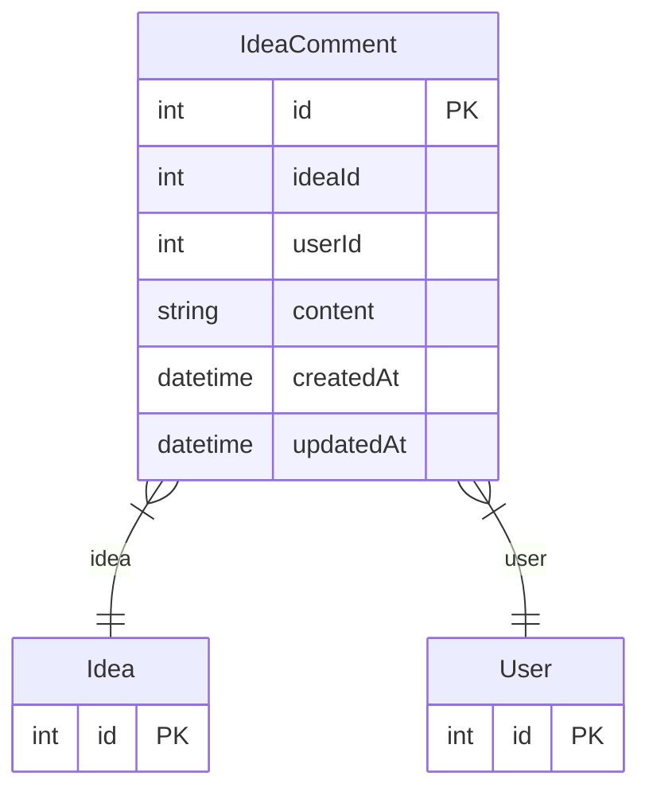

# IdeaComment

> Table name: `idea_comments`

**Schema location:** Lines 12670-12684

## Fields

| Field | Type | Required | Unique | Default | Notes |
|-------|------|----------|--------|---------|-------|
| `id` | `Int` | ✅ | 🔑 PK | `autoincrement(` |  |
| `ideaId` | `Int` | ✅ |  | `` |  |
| `userId` | `Int` | ✅ |  | `` |  |
| `content` | `String` | ✅ |  | `` | DB: Text |
| `createdAt` | `DateTime` | ✅ |  | `now(` |  |
| `updatedAt` | `DateTime` | ✅ |  | `` |  |

## Relations

| Field | Type | Cardinality | FK Fields | References | On Delete |
|-------|------|-------------|-----------|------------|-----------|
| `idea` | [Idea](./models/Idea.md) | Many-to-One | ideaId | id | Cascade |
| `user` | [User](./models/User.md) | Many-to-One | userId | id | Cascade |

## Referenced By

| Model | Field | Cardinality |
|-------|-------|-------------|
| [User](./models/User.md) | `ideaComments` | Has many |
| [Idea](./models/Idea.md) | `comments` | Has many |

## Indexes

- `ideaId`

## Entity Diagram

