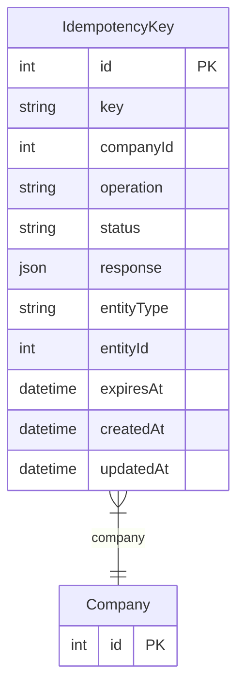

# IdempotencyKey

> Table name: `idempotency_keys`

**Schema location:** Lines 11147-11166

## Fields

| Field | Type | Required | Unique | Default | Notes |
|-------|------|----------|--------|---------|-------|
| `id` | `Int` | ✅ | 🔑 PK | `autoincrement(` |  |
| `key` | `String` | ✅ |  | `` | DB: VarChar(255) |
| `companyId` | `Int` | ✅ |  | `` |  |
| `operation` | `String` | ✅ |  | `` | DB: VarChar(50) |
| `status` | `String` | ✅ |  | `"PROCESSING"` | DB: VarChar(20). PROCESSING, COMPLETED, FAILED |
| `response` | `Json?` | ❌ |  | `` |  |
| `entityType` | `String?` | ❌ |  | `` | DB: VarChar(50) |
| `entityId` | `Int?` | ❌ |  | `` |  |
| `expiresAt` | `DateTime` | ✅ |  | `` |  |
| `createdAt` | `DateTime` | ✅ |  | `now(` |  |
| `updatedAt` | `DateTime` | ✅ |  | `` |  |

## Relations

| Field | Type | Cardinality | FK Fields | References | On Delete |
|-------|------|-------------|-----------|------------|-----------|
| `company` | [Company](./models/Company.md) | Many-to-One | companyId | id | Cascade |

## Referenced By

| Model | Field | Cardinality |
|-------|-------|-------------|
| [Company](./models/Company.md) | `idempotencyKeys` | Has many |

## Indexes

- `companyId`
- `expiresAt`

## Unique Constraints

- `key, companyId`

## Entity Diagram

