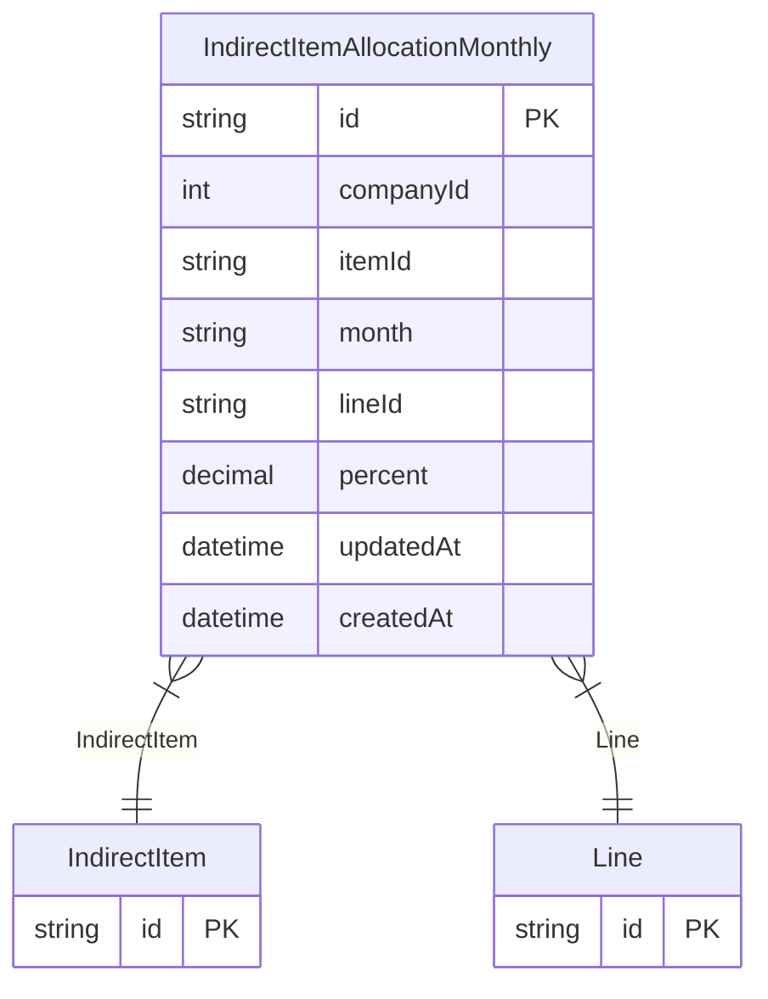

# IndirectItemAllocationMonthly

**Schema location:** Lines 3011-3026

## Fields

| Field | Type | Required | Unique | Default | Notes |
|-------|------|----------|--------|---------|-------|
| `id` | `String` | ✅ | 🔑 PK | `` |  |
| `companyId` | `Int` | ✅ |  | `` |  |
| `itemId` | `String` | ✅ |  | `` |  |
| `month` | `String` | ✅ |  | `` |  |
| `lineId` | `String` | ✅ |  | `` |  |
| `percent` | `Decimal` | ✅ |  | `` | DB: Decimal(5, 4) |
| `updatedAt` | `DateTime` | ✅ |  | `` |  |
| `createdAt` | `DateTime` | ✅ |  | `now(` |  |

## Relations

| Field | Type | Cardinality | FK Fields | References | On Delete |
|-------|------|-------------|-----------|------------|-----------|
| `IndirectItem` | [IndirectItem](./models/IndirectItem.md) | Many-to-One | itemId | id | - |
| `Line` | [Line](./models/Line.md) | Many-to-One | lineId | id | - |

## Referenced By

| Model | Field | Cardinality |
|-------|-------|-------------|
| [Line](./models/Line.md) | `IndirectItemAllocationMonthly` | Has many |
| [IndirectItem](./models/IndirectItem.md) | `IndirectItemAllocationMonthly` | Has many |

## Indexes

- `companyId, month`
- `itemId, month`

## Unique Constraints

- `companyId, itemId, month, lineId`

## Entity Diagram

