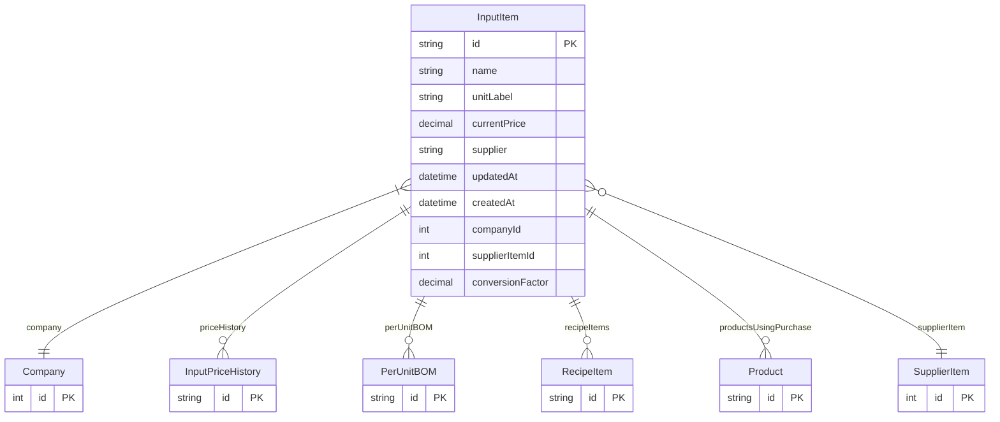

# InputItem

> Table name: `InputItem`

**Schema location:** Lines 2647-2669

## Fields

| Field | Type | Required | Unique | Default | Notes |
|-------|------|----------|--------|---------|-------|
| `id` | `String` | ✅ | 🔑 PK | `uuid(` |  |
| `name` | `String` | ✅ |  | `` |  |
| `unitLabel` | `String` | ✅ |  | `` |  |
| `currentPrice` | `Decimal` | ✅ |  | `` | DB: Decimal(12, 4) |
| `supplier` | `String?` | ❌ |  | `` |  |
| `updatedAt` | `DateTime` | ✅ |  | `` |  |
| `createdAt` | `DateTime` | ✅ |  | `now(` |  |
| `companyId` | `Int` | ✅ |  | `` |  |
| `supplierItemId` | `Int?` | ❌ |  | `` | Link a item de inventario para consumo de stock |
| `conversionFactor` | `Decimal` | ✅ |  | `1` | DB: Decimal(10, 4). Factor para convertir unidades |

## Relations

| Field | Type | Cardinality | FK Fields | References | On Delete |
|-------|------|-------------|-----------|------------|-----------|
| `company` | [Company](./models/Company.md) | Many-to-One | companyId | id | Cascade |
| `priceHistory` | [InputPriceHistory](./models/InputPriceHistory.md) | One-to-Many | - | - | - |
| `perUnitBOM` | [PerUnitBOM](./models/PerUnitBOM.md) | One-to-Many | - | - | - |
| `recipeItems` | [RecipeItem](./models/RecipeItem.md) | One-to-Many | - | - | - |
| `productsUsingPurchase` | [Product](./models/Product.md) | One-to-Many | - | - | - |
| `supplierItem` | [SupplierItem](./models/SupplierItem.md) | Many-to-One (optional) | supplierItemId | id | - |

## Referenced By

| Model | Field | Cardinality |
|-------|-------|-------------|
| [Company](./models/Company.md) | `inputItems` | Has many |
| [Product](./models/Product.md) | `purchaseInput` | Has one |
| [InputPriceHistory](./models/InputPriceHistory.md) | `input` | Has one |
| [RecipeItem](./models/RecipeItem.md) | `input` | Has one |
| [PerUnitBOM](./models/PerUnitBOM.md) | `input` | Has one |
| [SupplierItem](./models/SupplierItem.md) | `inputItems` | Has many |

## Indexes

- `supplierItemId`

## Entity Diagram

