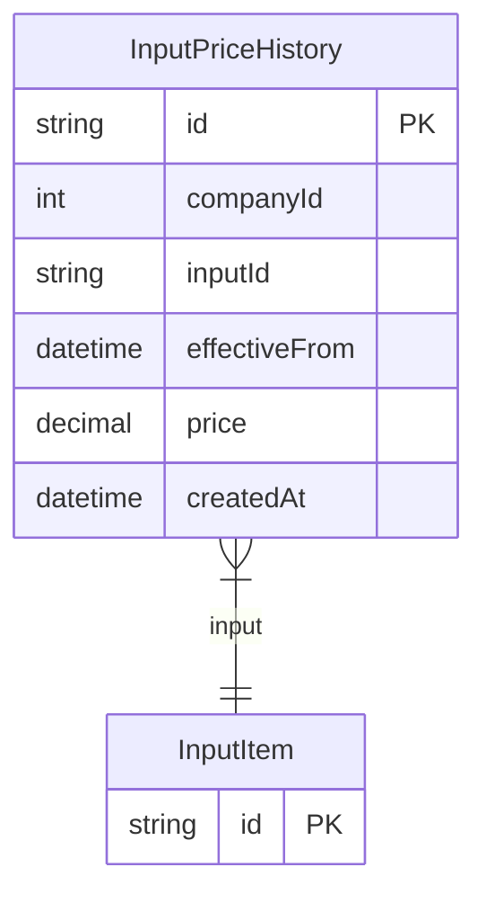

# InputPriceHistory

> Table name: `InputPriceHistory`

**Schema location:** Lines 2671-2683

## Fields

| Field | Type | Required | Unique | Default | Notes |
|-------|------|----------|--------|---------|-------|
| `id` | `String` | ✅ | 🔑 PK | `uuid(` |  |
| `companyId` | `Int` | ✅ |  | `` |  |
| `inputId` | `String` | ✅ |  | `` |  |
| `effectiveFrom` | `DateTime` | ✅ |  | `` |  |
| `price` | `Decimal` | ✅ |  | `` | DB: Decimal(12, 4) |
| `createdAt` | `DateTime` | ✅ |  | `now(` |  |

## Relations

| Field | Type | Cardinality | FK Fields | References | On Delete |
|-------|------|-------------|-----------|------------|-----------|
| `input` | [InputItem](./models/InputItem.md) | Many-to-One | inputId | id | Cascade |

## Referenced By

| Model | Field | Cardinality |
|-------|-------|-------------|
| [InputItem](./models/InputItem.md) | `priceHistory` | Has many |

## Indexes

- `inputId, effectiveFrom`
- `companyId, effectiveFrom`

## Entity Diagram

