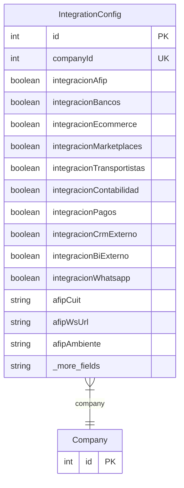

# IntegrationConfig

> Table name: `integration_config`

**Schema location:** Lines 15333-15387

## Fields

| Field | Type | Required | Unique | Default | Notes |
|-------|------|----------|--------|---------|-------|
| `id` | `Int` | ✅ | 🔑 PK | `autoincrement(` |  |
| `companyId` | `Int` | ✅ | ✅ | `` |  |
| `integracionAfip` | `Boolean` | ✅ |  | `false` | Integraciones habilitadas |
| `integracionBancos` | `Boolean` | ✅ |  | `false` |  |
| `integracionEcommerce` | `Boolean` | ✅ |  | `false` |  |
| `integracionMarketplaces` | `Boolean` | ✅ |  | `false` |  |
| `integracionTransportistas` | `Boolean` | ✅ |  | `false` |  |
| `integracionContabilidad` | `Boolean` | ✅ |  | `false` |  |
| `integracionPagos` | `Boolean` | ✅ |  | `false` |  |
| `integracionCrmExterno` | `Boolean` | ✅ |  | `false` |  |
| `integracionBiExterno` | `Boolean` | ✅ |  | `false` |  |
| `integracionWhatsapp` | `Boolean` | ✅ |  | `false` |  |
| `afipCuit` | `String?` | ❌ |  | `` | DB: VarChar(20). Configuración AFIP |
| `afipWsUrl` | `String?` | ❌ |  | `` | DB: VarChar(500) |
| `afipAmbiente` | `String` | ✅ |  | `"HOMOLOGACION"` | DB: VarChar(20) |
| `bancoProvider` | `String?` | ❌ |  | `` | DB: VarChar(50). Configuración Bancos |
| `bancoApiKey` | `String?` | ❌ |  | `` | DB: VarChar(500) |
| `bancoAutoImport` | `Boolean` | ✅ |  | `false` |  |
| `ecommercePlatform` | `String?` | ❌ |  | `` | DB: VarChar(50). Configuración E-commerce |
| `ecommerceApiUrl` | `String?` | ❌ |  | `` | DB: VarChar(500) |
| `ecommerceApiKey` | `String?` | ❌ |  | `` | DB: VarChar(500) |
| `ecommerceSyncStock` | `Boolean` | ✅ |  | `true` |  |
| `ecommerceSyncPrecios` | `Boolean` | ✅ |  | `true` |  |
| `mercadolibreEnabled` | `Boolean` | ✅ |  | `false` | Configuración Marketplaces |
| `mercadolibreClientId` | `String?` | ❌ |  | `` | DB: VarChar(200) |
| `mercadolibreClientSecret` | `String?` | ❌ |  | `` | DB: VarChar(200) |
| `transportistaProvider` | `String?` | ❌ |  | `` | DB: VarChar(50). Configuración Transportistas |
| `transportistaApiKey` | `String?` | ❌ |  | `` | DB: VarChar(500) |
| `transportistaAutoLabel` | `Boolean` | ✅ |  | `false` |  |
| `whatsappApiUrl` | `String?` | ❌ |  | `` | DB: VarChar(500). Configuración WhatsApp |
| `whatsappApiToken` | `String?` | ❌ |  | `` | DB: VarChar(500) |
| `whatsappTemplateIds` | `String?` | ❌ |  | `` |  |
| `createdAt` | `DateTime` | ✅ |  | `now(` |  |
| `updatedAt` | `DateTime` | ✅ |  | `` |  |

## Relations

| Field | Type | Cardinality | FK Fields | References | On Delete |
|-------|------|-------------|-----------|------------|-----------|
| `company` | [Company](./models/Company.md) | Many-to-One | companyId | id | Cascade |

## Referenced By

| Model | Field | Cardinality |
|-------|-------|-------------|
| [Company](./models/Company.md) | `integrationConfig` | Has one |

## Entity Diagram

