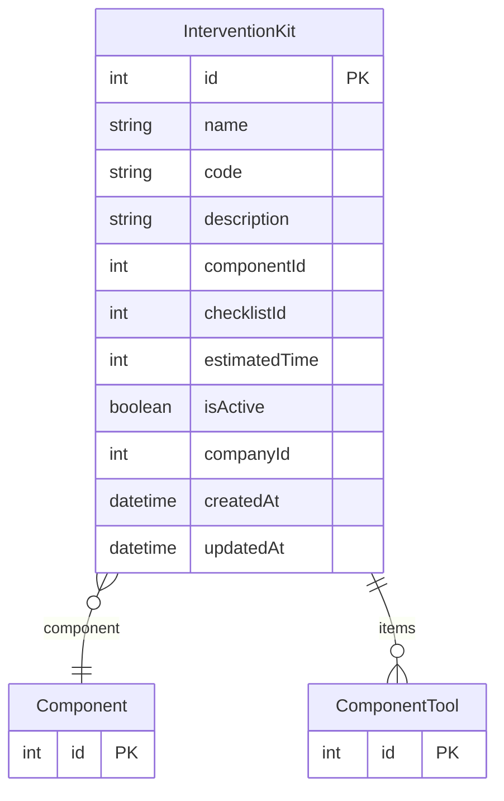

# InterventionKit

> Table name: `intervention_kits`

**Schema location:** Lines 1389-1407

## Fields

| Field | Type | Required | Unique | Default | Notes |
|-------|------|----------|--------|---------|-------|
| `id` | `Int` | ✅ | 🔑 PK | `autoincrement(` |  |
| `name` | `String` | ✅ |  | `` | "Kit cambio de rodamientos bomba X" |
| `code` | `String?` | ❌ |  | `` | Código único del kit |
| `description` | `String?` | ❌ |  | `` |  |
| `componentId` | `Int?` | ❌ |  | `` | Para qué componente (opcional) |
| `checklistId` | `Int?` | ❌ |  | `` | Vinculado a qué PM/checklist (opcional) |
| `estimatedTime` | `Int?` | ❌ |  | `` | Minutos estimados para usar el kit |
| `isActive` | `Boolean` | ✅ |  | `true` |  |
| `companyId` | `Int` | ✅ |  | `` |  |
| `createdAt` | `DateTime` | ✅ |  | `now(` |  |
| `updatedAt` | `DateTime` | ✅ |  | `` |  |

## Relations

| Field | Type | Cardinality | FK Fields | References | On Delete |
|-------|------|-------------|-----------|------------|-----------|
| `component` | [Component](./models/Component.md) | Many-to-One (optional) | componentId | id | - |
| `items` | [ComponentTool](./models/ComponentTool.md) | One-to-Many | - | - | - |

## Referenced By

| Model | Field | Cardinality |
|-------|-------|-------------|
| [Component](./models/Component.md) | `interventionKits` | Has many |
| [ComponentTool](./models/ComponentTool.md) | `kit` | Has one |

## Indexes

- `companyId, isActive`

## Entity Diagram

