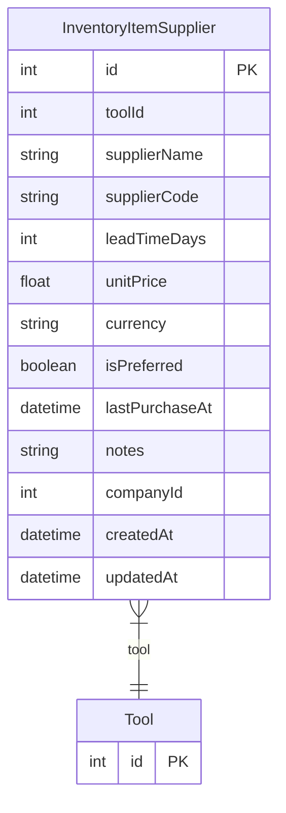

# InventoryItemSupplier

> Table name: `inventory_item_suppliers`

**Schema location:** Lines 1430-1449

## Fields

| Field | Type | Required | Unique | Default | Notes |
|-------|------|----------|--------|---------|-------|
| `id` | `Int` | ✅ | 🔑 PK | `autoincrement(` |  |
| `toolId` | `Int` | ✅ |  | `` |  |
| `supplierName` | `String` | ✅ |  | `` |  |
| `supplierCode` | `String?` | ❌ |  | `` | Código del proveedor para este item |
| `leadTimeDays` | `Int?` | ❌ |  | `` | Tiempo de entrega en días |
| `unitPrice` | `Float?` | ❌ |  | `` |  |
| `currency` | `String` | ✅ |  | `"ARS"` |  |
| `isPreferred` | `Boolean` | ✅ |  | `false` |  |
| `lastPurchaseAt` | `DateTime?` | ❌ |  | `` |  |
| `notes` | `String?` | ❌ |  | `` |  |
| `companyId` | `Int` | ✅ |  | `` |  |
| `createdAt` | `DateTime` | ✅ |  | `now(` |  |
| `updatedAt` | `DateTime` | ✅ |  | `` |  |

## Relations

| Field | Type | Cardinality | FK Fields | References | On Delete |
|-------|------|-------------|-----------|------------|-----------|
| `tool` | [Tool](./models/Tool.md) | Many-to-One | toolId | id | Cascade |

## Referenced By

| Model | Field | Cardinality |
|-------|-------|-------------|
| [Tool](./models/Tool.md) | `suppliers` | Has many |

## Indexes

- `toolId`
- `companyId, isPreferred`

## Entity Diagram

