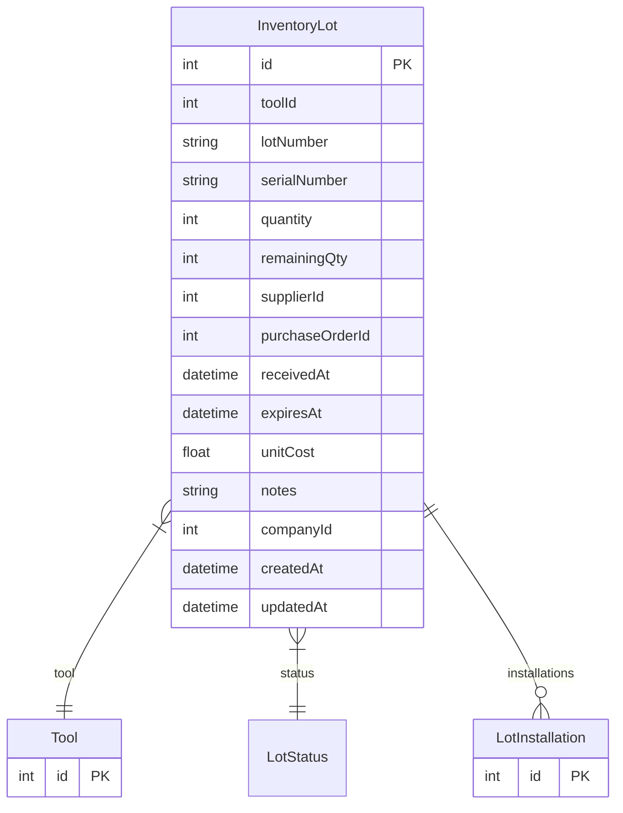

# InventoryLot

> Table name: `inventory_lots`

**Schema location:** Lines 1452-1477

## Fields

| Field | Type | Required | Unique | Default | Notes |
|-------|------|----------|--------|---------|-------|
| `id` | `Int` | ✅ | 🔑 PK | `autoincrement(` |  |
| `toolId` | `Int` | ✅ |  | `` |  |
| `lotNumber` | `String` | ✅ |  | `` |  |
| `serialNumber` | `String?` | ❌ |  | `` | Si aplica número de serie |
| `quantity` | `Int` | ✅ |  | `` | Cantidad original del lote |
| `remainingQty` | `Int` | ✅ |  | `` | Cantidad restante |
| `supplierId` | `Int?` | ❌ |  | `` | Referencia al proveedor |
| `purchaseOrderId` | `Int?` | ❌ |  | `` | Referencia a orden de compra |
| `receivedAt` | `DateTime` | ✅ |  | `now(` |  |
| `expiresAt` | `DateTime?` | ❌ |  | `` | Fecha de vencimiento (si aplica) |
| `unitCost` | `Float?` | ❌ |  | `` | Costo unitario del lote |
| `notes` | `String?` | ❌ |  | `` |  |
| `companyId` | `Int` | ✅ |  | `` |  |
| `createdAt` | `DateTime` | ✅ |  | `now(` |  |
| `updatedAt` | `DateTime` | ✅ |  | `` |  |

## Relations

| Field | Type | Cardinality | FK Fields | References | On Delete |
|-------|------|-------------|-----------|------------|-----------|
| `tool` | [Tool](./models/Tool.md) | Many-to-One | toolId | id | Cascade |
| `status` | [LotStatus](./models/LotStatus.md) | Many-to-One | - | - | - |
| `installations` | [LotInstallation](./models/LotInstallation.md) | One-to-Many | - | - | - |

## Referenced By

| Model | Field | Cardinality |
|-------|-------|-------------|
| [Tool](./models/Tool.md) | `lots` | Has many |
| [LotInstallation](./models/LotInstallation.md) | `lot` | Has one |

## Indexes

- `companyId, status`
- `expiresAt`

## Unique Constraints

- `toolId, lotNumber, companyId`

## Entity Diagram

