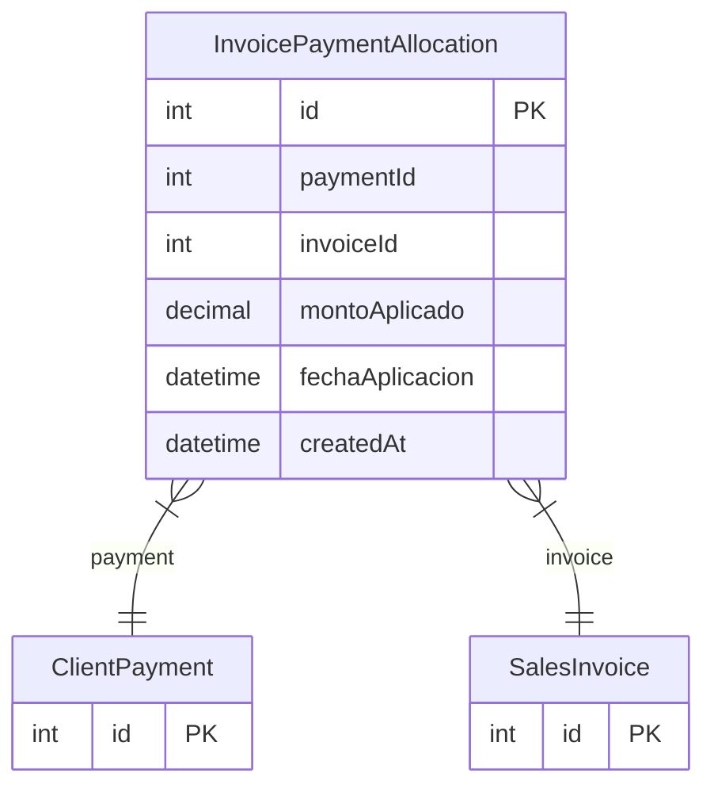

# InvoicePaymentAllocation

> Table name: `invoice_payment_allocations`

**Schema location:** Lines 9812-9826

## Fields

| Field | Type | Required | Unique | Default | Notes |
|-------|------|----------|--------|---------|-------|
| `id` | `Int` | ✅ | 🔑 PK | `autoincrement(` |  |
| `paymentId` | `Int` | ✅ |  | `` |  |
| `invoiceId` | `Int` | ✅ |  | `` |  |
| `montoAplicado` | `Decimal` | ✅ |  | `` | DB: Decimal(15, 2) |
| `fechaAplicacion` | `DateTime` | ✅ |  | `now(` |  |
| `createdAt` | `DateTime` | ✅ |  | `now(` |  |

## Relations

| Field | Type | Cardinality | FK Fields | References | On Delete |
|-------|------|-------------|-----------|------------|-----------|
| `payment` | [ClientPayment](./models/ClientPayment.md) | Many-to-One | paymentId | id | Cascade |
| `invoice` | [SalesInvoice](./models/SalesInvoice.md) | Many-to-One | invoiceId | id | - |

## Referenced By

| Model | Field | Cardinality |
|-------|-------|-------------|
| [SalesInvoice](./models/SalesInvoice.md) | `paymentAllocations` | Has many |
| [ClientPayment](./models/ClientPayment.md) | `allocations` | Has many |

## Indexes

- `paymentId`
- `invoiceId`

## Entity Diagram

