# KilometrajeLog

> Table name: `KilometrajeLog`

**Schema location:** Lines 913-931

## Fields

| Field | Type | Required | Unique | Default | Notes |
|-------|------|----------|--------|---------|-------|
| `id` | `Int` | ✅ | 🔑 PK | `autoincrement(` |  |
| `unidadMovilId` | `Int` | ✅ |  | `` |  |
| `kilometraje` | `Int` | ✅ |  | `` | Lectura del odómetro |
| `fecha` | `DateTime` | ✅ |  | `now(` |  |
| `registradoPorId` | `Int?` | ❌ |  | `` | Usuario que registró |
| `notas` | `String?` | ❌ |  | `` |  |
| `companyId` | `Int` | ✅ |  | `` |  |
| `createdAt` | `DateTime` | ✅ |  | `now(` |  |

## Relations

| Field | Type | Cardinality | FK Fields | References | On Delete |
|-------|------|-------------|-----------|------------|-----------|
| `tipo` | [KilometrajeLogTipo](./models/KilometrajeLogTipo.md) | Many-to-One | - | - | - |
| `unidadMovil` | [UnidadMovil](./models/UnidadMovil.md) | Many-to-One | unidadMovilId | id | Cascade |
| `registradoPor` | [User](./models/User.md) | Many-to-One (optional) | registradoPorId | id | SetNull |
| `company` | [Company](./models/Company.md) | Many-to-One | companyId | id | Cascade |

## Referenced By

| Model | Field | Cardinality |
|-------|-------|-------------|
| [Company](./models/Company.md) | `kilometrajeLogs` | Has many |
| [User](./models/User.md) | `kilometrajeLogs` | Has many |
| [UnidadMovil](./models/UnidadMovil.md) | `kilometrajeLogs` | Has many |

## Indexes

- `unidadMovilId, fecha`
- `companyId, fecha`

## Entity Diagram

```mermaid
erDiagram
    KilometrajeLog {
        int id PK
        int unidadMovilId
        int kilometraje
        datetime fecha
        int registradoPorId
        string notas
        int companyId
        datetime createdAt
    }
    UnidadMovil {
        int id PK
    }
    User {
        int id PK
    }
    Company {
        int id PK
    }
    KilometrajeLog }|--|| KilometrajeLogTipo : "tipo"
    KilometrajeLog }|--|| UnidadMovil : "unidadMovil"
    KilometrajeLog }o--|| User : "registradoPor"
    KilometrajeLog }|--|| Company : "company"
```

