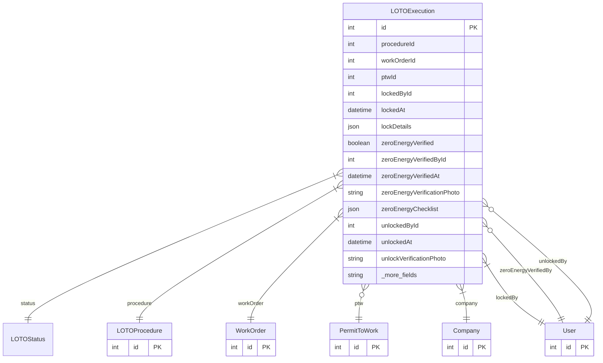

# LOTOExecution

> Table name: `loto_executions`

**Schema location:** Lines 12980-13038

## Fields

| Field | Type | Required | Unique | Default | Notes |
|-------|------|----------|--------|---------|-------|
| `id` | `Int` | ✅ | 🔑 PK | `autoincrement(` |  |
| `procedureId` | `Int` | ✅ |  | `` |  |
| `workOrderId` | `Int` | ✅ |  | `` |  |
| `ptwId` | `Int?` | ❌ |  | `` | Optional link to Permit to Work |
| `lockedById` | `Int` | ✅ |  | `` | Lock application |
| `lockedAt` | `DateTime` | ✅ |  | `now(` |  |
| `lockDetails` | `Json` | ✅ |  | `"[]"` | Format: [{"lockNumber": "L-001", "location": "Panel A", "energySource": "Electrical", "lockedById": 1, "lockedAt": "..."}] |
| `zeroEnergyVerified` | `Boolean` | ✅ |  | `false` | Zero energy verification |
| `zeroEnergyVerifiedById` | `Int?` | ❌ |  | `` |  |
| `zeroEnergyVerifiedAt` | `DateTime?` | ❌ |  | `` |  |
| `zeroEnergyVerificationPhoto` | `String?` | ❌ |  | `` | URL to photo proof |
| `zeroEnergyChecklist` | `Json?` | ❌ |  | `"[]"` | Format: [{"step": "Try start button", "result": "OK", "verifiedById": 1, "verifiedAt": "..."}] |
| `unlockedById` | `Int?` | ❌ |  | `` | Unlock (when work complete) |
| `unlockedAt` | `DateTime?` | ❌ |  | `` |  |
| `unlockVerificationPhoto` | `String?` | ❌ |  | `` |  |
| `workersAccountedFor` | `Json?` | ❌ |  | `"[]"` | Format: [{"userId": 1, "name": "John Doe", "confirmedAt": "..."}] |
| `notes` | `String?` | ❌ |  | `` | Notes |
| `incidentsReported` | `String?` | ❌ |  | `` |  |
| `companyId` | `Int` | ✅ |  | `` | Metadata |
| `createdAt` | `DateTime` | ✅ |  | `now(` |  |
| `updatedAt` | `DateTime` | ✅ |  | `` |  |

## Relations

| Field | Type | Cardinality | FK Fields | References | On Delete |
|-------|------|-------------|-----------|------------|-----------|
| `status` | [LOTOStatus](./models/LOTOStatus.md) | Many-to-One | - | - | - |
| `procedure` | [LOTOProcedure](./models/LOTOProcedure.md) | Many-to-One | procedureId | id | - |
| `workOrder` | [WorkOrder](./models/WorkOrder.md) | Many-to-One | workOrderId | id | - |
| `ptw` | [PermitToWork](./models/PermitToWork.md) | Many-to-One (optional) | ptwId | id | - |
| `company` | [Company](./models/Company.md) | Many-to-One | companyId | id | Cascade |
| `lockedBy` | [User](./models/User.md) | Many-to-One | lockedById | id | - |
| `zeroEnergyVerifiedBy` | [User](./models/User.md) | Many-to-One (optional) | zeroEnergyVerifiedById | id | - |
| `unlockedBy` | [User](./models/User.md) | Many-to-One (optional) | unlockedById | id | - |

## Referenced By

| Model | Field | Cardinality |
|-------|-------|-------------|
| [Company](./models/Company.md) | `lotoExecutions` | Has many |
| [User](./models/User.md) | `lotoLockedBy` | Has many |
| [User](./models/User.md) | `lotoZeroEnergyVerifiedBy` | Has many |
| [User](./models/User.md) | `lotoUnlockedBy` | Has many |
| [WorkOrder](./models/WorkOrder.md) | `lotoExecutions` | Has many |
| [LOTOProcedure](./models/LOTOProcedure.md) | `executions` | Has many |
| [PermitToWork](./models/PermitToWork.md) | `lotoExecutions` | Has many |

## Indexes

- `procedureId`
- `workOrderId`
- `ptwId`
- `status`
- `companyId, status`

## Entity Diagram

