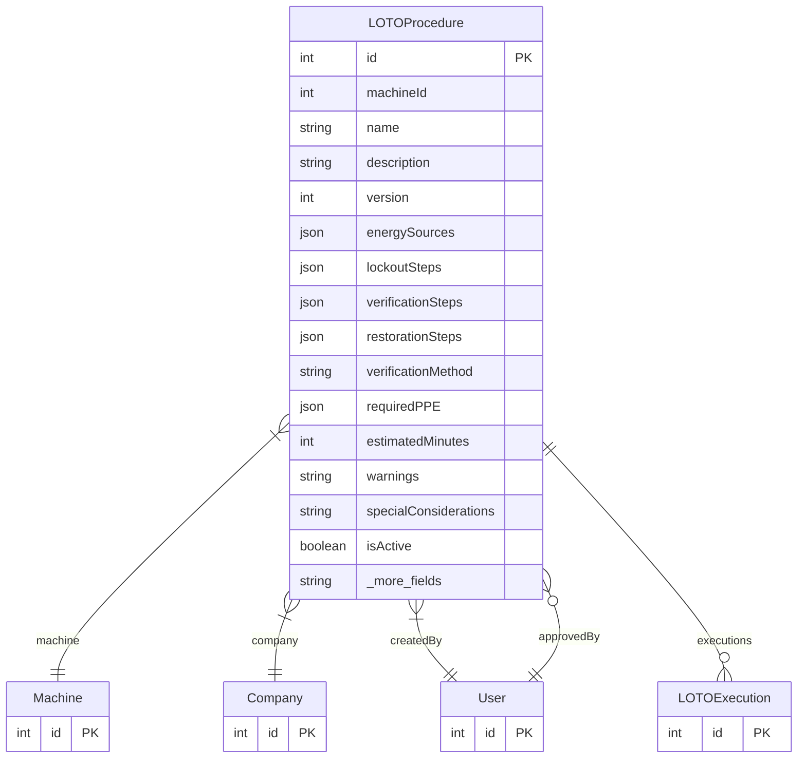

# LOTOProcedure

> Table name: `loto_procedures`

**Schema location:** Lines 12805-12864

## Fields

| Field | Type | Required | Unique | Default | Notes |
|-------|------|----------|--------|---------|-------|
| `id` | `Int` | ✅ | 🔑 PK | `autoincrement(` |  |
| `machineId` | `Int` | ✅ |  | `` |  |
| `name` | `String` | ✅ |  | `` |  |
| `description` | `String?` | ❌ |  | `` |  |
| `version` | `Int` | ✅ |  | `1` |  |
| `energySources` | `Json` | ✅ |  | `"[]"` | Format: [{"type": "ELECTRICAL", "location": "Panel A", "method": "Breaker 15", "verification": "Multimeter test"}] |
| `lockoutSteps` | `Json` | ✅ |  | `"[]"` | Format: [{"order": 1, "description": "Turn off main breaker", "energySourceId": 1, "photo": "url"}] |
| `verificationSteps` | `Json` | ✅ |  | `"[]"` | Format: [{"order": 1, "description": "Try start button", "expectedResult": "No movement"}] |
| `restorationSteps` | `Json` | ✅ |  | `"[]"` | Format: [{"order": 1, "description": "Remove all locks", "warning": "Verify area clear"}] |
| `verificationMethod` | `String?` | ❌ |  | `` | Verification method after lockout |
| `requiredPPE` | `Json?` | ❌ |  | `"[]"` | PPE required during LOTO |
| `estimatedMinutes` | `Int?` | ❌ |  | `` | Estimated time in minutes |
| `warnings` | `String?` | ❌ |  | `` | Warnings and special considerations |
| `specialConsiderations` | `String?` | ❌ |  | `` |  |
| `isActive` | `Boolean` | ✅ |  | `true` | Status |
| `isApproved` | `Boolean` | ✅ |  | `false` |  |
| `approvedById` | `Int?` | ❌ |  | `` |  |
| `approvedAt` | `DateTime?` | ❌ |  | `` |  |
| `companyId` | `Int` | ✅ |  | `` | Metadata |
| `createdById` | `Int` | ✅ |  | `` |  |
| `createdAt` | `DateTime` | ✅ |  | `now(` |  |
| `updatedAt` | `DateTime` | ✅ |  | `` |  |

## Relations

| Field | Type | Cardinality | FK Fields | References | On Delete |
|-------|------|-------------|-----------|------------|-----------|
| `machine` | [Machine](./models/Machine.md) | Many-to-One | machineId | id | Cascade |
| `company` | [Company](./models/Company.md) | Many-to-One | companyId | id | Cascade |
| `createdBy` | [User](./models/User.md) | Many-to-One | createdById | id | - |
| `approvedBy` | [User](./models/User.md) | Many-to-One (optional) | approvedById | id | - |
| `executions` | [LOTOExecution](./models/LOTOExecution.md) | One-to-Many | - | - | - |

## Referenced By

| Model | Field | Cardinality |
|-------|-------|-------------|
| [Company](./models/Company.md) | `lotoProcedures` | Has many |
| [User](./models/User.md) | `lotoProceduresCreated` | Has many |
| [User](./models/User.md) | `lotoProceduresApproved` | Has many |
| [Machine](./models/Machine.md) | `lotoProcedures` | Has many |
| [LOTOExecution](./models/LOTOExecution.md) | `procedure` | Has one |

## Indexes

- `machineId`
- `companyId`
- `isActive`

## Entity Diagram

