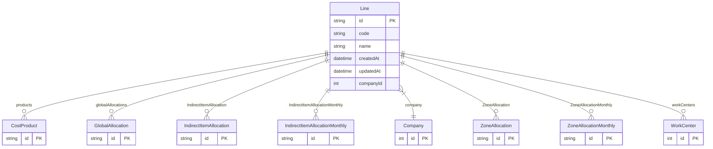

# Line

> Table name: `Line`

**Schema location:** Lines 2587-2607

## Fields

| Field | Type | Required | Unique | Default | Notes |
|-------|------|----------|--------|---------|-------|
| `id` | `String` | ✅ | 🔑 PK | `uuid(` |  |
| `code` | `String` | ✅ |  | `` |  |
| `name` | `String` | ✅ |  | `` |  |
| `createdAt` | `DateTime` | ✅ |  | `now(` |  |
| `updatedAt` | `DateTime` | ✅ |  | `` |  |
| `companyId` | `Int` | ✅ |  | `` |  |

## Relations

| Field | Type | Cardinality | FK Fields | References | On Delete |
|-------|------|-------------|-----------|------------|-----------|
| `products` | [CostProduct](./models/CostProduct.md) | One-to-Many | - | - | - |
| `globalAllocations` | [GlobalAllocation](./models/GlobalAllocation.md) | One-to-Many | - | - | - |
| `IndirectItemAllocation` | [IndirectItemAllocation](./models/IndirectItemAllocation.md) | One-to-Many | - | - | - |
| `IndirectItemAllocationMonthly` | [IndirectItemAllocationMonthly](./models/IndirectItemAllocationMonthly.md) | One-to-Many | - | - | - |
| `company` | [Company](./models/Company.md) | Many-to-One | companyId | id | Cascade |
| `ZoneAllocation` | [ZoneAllocation](./models/ZoneAllocation.md) | One-to-Many | - | - | - |
| `ZoneAllocationMonthly` | [ZoneAllocationMonthly](./models/ZoneAllocationMonthly.md) | One-to-Many | - | - | - |
| `workCenters` | [WorkCenter](./models/WorkCenter.md) | One-to-Many | - | - | - |

## Referenced By

| Model | Field | Cardinality |
|-------|-------|-------------|
| [Company](./models/Company.md) | `lines` | Has many |
| [CostProduct](./models/CostProduct.md) | `line` | Has one |
| [GlobalAllocation](./models/GlobalAllocation.md) | `line` | Has one |
| [IndirectItemAllocation](./models/IndirectItemAllocation.md) | `Line` | Has one |
| [IndirectItemAllocationMonthly](./models/IndirectItemAllocationMonthly.md) | `Line` | Has one |
| [ZoneAllocation](./models/ZoneAllocation.md) | `Line` | Has one |
| [ZoneAllocationMonthly](./models/ZoneAllocationMonthly.md) | `Line` | Has one |
| [WorkCenter](./models/WorkCenter.md) | `line` | Has one |

## Unique Constraints

- `companyId, code`

## Entity Diagram

