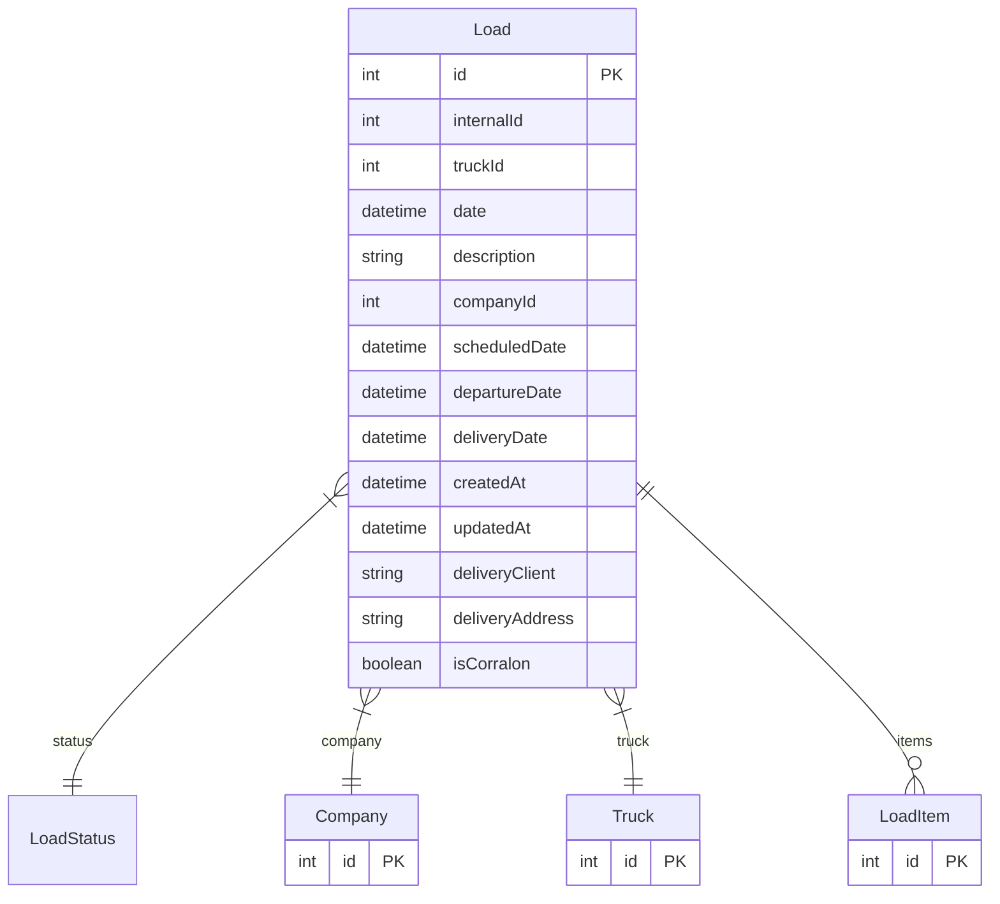

# Load

> Table name: `Load`

**Schema location:** Lines 4111-4138

## Fields

| Field | Type | Required | Unique | Default | Notes |
|-------|------|----------|--------|---------|-------|
| `id` | `Int` | ✅ | 🔑 PK | `autoincrement(` |  |
| `internalId` | `Int?` | ❌ |  | `` | ID interno único por empresa |
| `truckId` | `Int` | ✅ |  | `` |  |
| `date` | `DateTime` | ✅ |  | `now(` |  |
| `description` | `String?` | ❌ |  | `` |  |
| `companyId` | `Int` | ✅ |  | `` |  |
| `scheduledDate` | `DateTime?` | ❌ |  | `` | Fecha programada de carga |
| `departureDate` | `DateTime?` | ❌ |  | `` | Fecha/hora de salida real |
| `deliveryDate` | `DateTime?` | ❌ |  | `` | Fecha/hora de entrega real |
| `createdAt` | `DateTime` | ✅ |  | `now(` |  |
| `updatedAt` | `DateTime` | ✅ |  | `` |  |
| `deliveryClient` | `String?` | ❌ |  | `` |  |
| `deliveryAddress` | `String?` | ❌ |  | `` |  |
| `isCorralon` | `Boolean?` | ❌ |  | `false` |  |

## Relations

| Field | Type | Cardinality | FK Fields | References | On Delete |
|-------|------|-------------|-----------|------------|-----------|
| `status` | [LoadStatus](./models/LoadStatus.md) | Many-to-One | - | - | - |
| `company` | [Company](./models/Company.md) | Many-to-One | companyId | id | Cascade |
| `truck` | [Truck](./models/Truck.md) | Many-to-One | truckId | id | Cascade |
| `items` | [LoadItem](./models/LoadItem.md) | One-to-Many | - | - | - |

## Referenced By

| Model | Field | Cardinality |
|-------|-------|-------------|
| [Company](./models/Company.md) | `loads` | Has many |
| [Truck](./models/Truck.md) | `loads` | Has many |
| [LoadItem](./models/LoadItem.md) | `load` | Has one |

## Indexes

- `companyId`
- `truckId`
- `date`
- `internalId`
- `status`

## Unique Constraints

- `companyId, internalId`

## Entity Diagram

