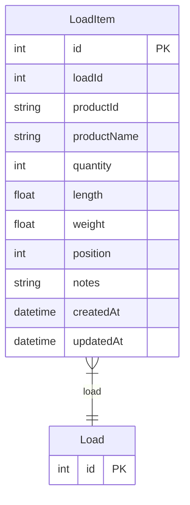

# LoadItem

> Table name: `LoadItem`

**Schema location:** Lines 4140-4157

## Fields

| Field | Type | Required | Unique | Default | Notes |
|-------|------|----------|--------|---------|-------|
| `id` | `Int` | ✅ | 🔑 PK | `autoincrement(` |  |
| `loadId` | `Int` | ✅ |  | `` |  |
| `productId` | `String` | ✅ |  | `` |  |
| `productName` | `String` | ✅ |  | `` |  |
| `quantity` | `Int` | ✅ |  | `` |  |
| `length` | `Float?` | ❌ |  | `` |  |
| `weight` | `Float?` | ❌ |  | `` |  |
| `position` | `Int` | ✅ |  | `` |  |
| `notes` | `String?` | ❌ |  | `` |  |
| `createdAt` | `DateTime` | ✅ |  | `now(` |  |
| `updatedAt` | `DateTime` | ✅ |  | `` |  |

## Relations

| Field | Type | Cardinality | FK Fields | References | On Delete |
|-------|------|-------------|-----------|------------|-----------|
| `load` | [Load](./models/Load.md) | Many-to-One | loadId | id | Cascade |

## Referenced By

| Model | Field | Cardinality |
|-------|-------|-------------|
| [Load](./models/Load.md) | `items` | Has many |

## Indexes

- `loadId`
- `productId`

## Entity Diagram

