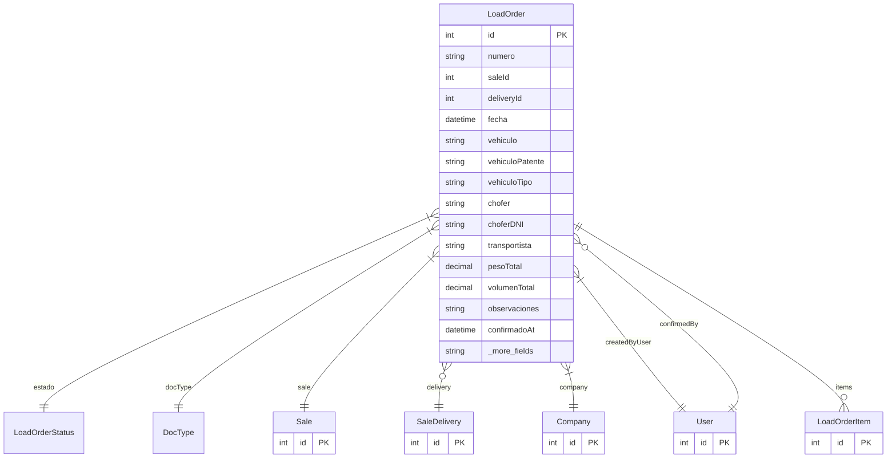

# LoadOrder

> Table name: `load_orders`

**Schema location:** Lines 9375-9437

## Fields

| Field | Type | Required | Unique | Default | Notes |
|-------|------|----------|--------|---------|-------|
| `id` | `Int` | ✅ | 🔑 PK | `autoincrement(` |  |
| `numero` | `String` | ✅ |  | `` | DB: VarChar(50) |
| `saleId` | `Int` | ✅ |  | `` |  |
| `deliveryId` | `Int?` | ❌ |  | `` |  |
| `fecha` | `DateTime` | ✅ |  | `` | DB: Date. Fecha |
| `vehiculo` | `String?` | ❌ |  | `` | DB: VarChar(100). Vehículo |
| `vehiculoPatente` | `String?` | ❌ |  | `` | DB: VarChar(20) |
| `vehiculoTipo` | `String?` | ❌ |  | `` | DB: VarChar(50). CAMIONETA, FURGON, CAMION_PEQUEÑO, etc. |
| `chofer` | `String?` | ❌ |  | `` | DB: VarChar(255). Conductor |
| `choferDNI` | `String?` | ❌ |  | `` | DB: VarChar(20) |
| `transportista` | `String?` | ❌ |  | `` | DB: VarChar(255). Transportista |
| `pesoTotal` | `Decimal?` | ❌ |  | `` | DB: Decimal(15, 2). kg |
| `volumenTotal` | `Decimal?` | ❌ |  | `` | DB: Decimal(15, 4). m³ |
| `observaciones` | `String?` | ❌ |  | `` | Notas |
| `confirmadoAt` | `DateTime?` | ❌ |  | `` | Confirmación |
| `confirmedById` | `Int?` | ❌ |  | `` |  |
| `firmaOperario` | `String?` | ❌ |  | `` | Firma del operario (base64) |
| `companyId` | `Int` | ✅ |  | `` | Tracking |
| `createdBy` | `Int` | ✅ |  | `` |  |
| `createdAt` | `DateTime` | ✅ |  | `now(` |  |
| `updatedAt` | `DateTime` | ✅ |  | `` |  |

## Relations

| Field | Type | Cardinality | FK Fields | References | On Delete |
|-------|------|-------------|-----------|------------|-----------|
| `estado` | [LoadOrderStatus](./models/LoadOrderStatus.md) | Many-to-One | - | - | - |
| `docType` | [DocType](./models/DocType.md) | Many-to-One | - | - | - |
| `sale` | [Sale](./models/Sale.md) | Many-to-One | saleId | id | - |
| `delivery` | [SaleDelivery](./models/SaleDelivery.md) | Many-to-One (optional) | deliveryId | id | - |
| `company` | [Company](./models/Company.md) | Many-to-One | companyId | id | Cascade |
| `createdByUser` | [User](./models/User.md) | Many-to-One | createdBy | id | - |
| `confirmedBy` | [User](./models/User.md) | Many-to-One (optional) | confirmedById | id | - |
| `items` | [LoadOrderItem](./models/LoadOrderItem.md) | One-to-Many | - | - | - |

## Referenced By

| Model | Field | Cardinality |
|-------|-------|-------------|
| [Company](./models/Company.md) | `loadOrders` | Has many |
| [User](./models/User.md) | `loadOrdersCreated` | Has many |
| [User](./models/User.md) | `loadOrdersConfirmed` | Has many |
| [Sale](./models/Sale.md) | `loadOrders` | Has many |
| [SaleDelivery](./models/SaleDelivery.md) | `loadOrders` | Has many |
| [LoadOrderItem](./models/LoadOrderItem.md) | `loadOrder` | Has one |

## Indexes

- `companyId`
- `saleId`
- `deliveryId`
- `estado`
- `fecha`
- `docType`
- `companyId, docType`

## Unique Constraints

- `companyId, numero`

## Entity Diagram

