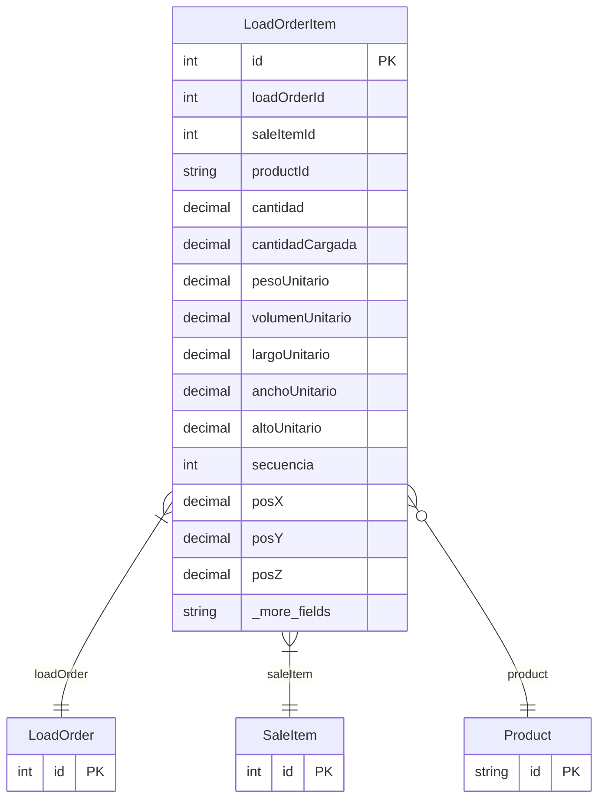

# LoadOrderItem

> Table name: `load_order_items`

**Schema location:** Lines 9439-9479

## Fields

| Field | Type | Required | Unique | Default | Notes |
|-------|------|----------|--------|---------|-------|
| `id` | `Int` | ✅ | 🔑 PK | `autoincrement(` |  |
| `loadOrderId` | `Int` | ✅ |  | `` |  |
| `saleItemId` | `Int` | ✅ |  | `` |  |
| `productId` | `String?` | ❌ |  | `` |  |
| `cantidad` | `Decimal` | ✅ |  | `` | DB: Decimal(15, 4). Cantidades |
| `cantidadCargada` | `Decimal?` | ❌ |  | `` | DB: Decimal(15, 4) |
| `pesoUnitario` | `Decimal?` | ❌ |  | `` | DB: Decimal(15, 4). kg por unidad |
| `volumenUnitario` | `Decimal?` | ❌ |  | `` | DB: Decimal(15, 6). m³ por unidad |
| `largoUnitario` | `Decimal?` | ❌ |  | `` | DB: Decimal(10, 3). metros |
| `anchoUnitario` | `Decimal?` | ❌ |  | `` | DB: Decimal(10, 3). metros |
| `altoUnitario` | `Decimal?` | ❌ |  | `` | DB: Decimal(10, 3). metros |
| `secuencia` | `Int?` | ❌ |  | `` | Orden de carga |
| `posX` | `Decimal?` | ❌ |  | `` | DB: Decimal(10, 3). Posición X en metros |
| `posY` | `Decimal?` | ❌ |  | `` | DB: Decimal(10, 3). Posición Y en metros |
| `posZ` | `Decimal?` | ❌ |  | `` | DB: Decimal(10, 3). Posición Z en metros |
| `motivoDiferencia` | `String?` | ❌ |  | `` | Diferencias |
| `observaciones` | `String?` | ❌ |  | `` | Notas |
| `createdAt` | `DateTime` | ✅ |  | `now(` |  |

## Relations

| Field | Type | Cardinality | FK Fields | References | On Delete |
|-------|------|-------------|-----------|------------|-----------|
| `loadOrder` | [LoadOrder](./models/LoadOrder.md) | Many-to-One | loadOrderId | id | Cascade |
| `saleItem` | [SaleItem](./models/SaleItem.md) | Many-to-One | saleItemId | id | - |
| `product` | [Product](./models/Product.md) | Many-to-One (optional) | productId | id | - |

## Referenced By

| Model | Field | Cardinality |
|-------|-------|-------------|
| [Product](./models/Product.md) | `loadOrderItems` | Has many |
| [SaleItem](./models/SaleItem.md) | `loadOrderItems` | Has many |
| [LoadOrder](./models/LoadOrder.md) | `items` | Has many |

## Indexes

- `loadOrderId`
- `saleItemId`
- `productId`

## Entity Diagram

