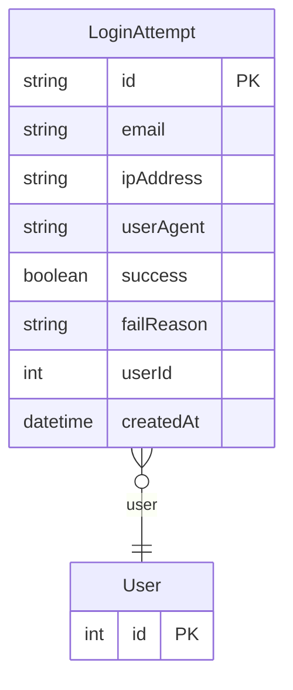

# LoginAttempt

> Table name: `login_attempts`

**Schema location:** Lines 8105-8120

## Fields

| Field | Type | Required | Unique | Default | Notes |
|-------|------|----------|--------|---------|-------|
| `id` | `String` | ✅ | 🔑 PK | `uuid(` |  |
| `email` | `String` | ✅ |  | `` |  |
| `ipAddress` | `String` | ✅ |  | `` |  |
| `userAgent` | `String?` | ❌ |  | `` |  |
| `success` | `Boolean` | ✅ |  | `` |  |
| `failReason` | `String?` | ❌ |  | `` | "invalid_password" | "user_not_found" | "blocked" | "2fa_failed" | "inactive" |
| `userId` | `Int?` | ❌ |  | `` |  |
| `createdAt` | `DateTime` | ✅ |  | `now(` |  |

## Relations

| Field | Type | Cardinality | FK Fields | References | On Delete |
|-------|------|-------------|-----------|------------|-----------|
| `user` | [User](./models/User.md) | Many-to-One (optional) | userId | id | - |

## Referenced By

| Model | Field | Cardinality |
|-------|-------|-------------|
| [User](./models/User.md) | `loginAttempts` | Has many |

## Indexes

- `email, createdAt`
- `ipAddress, createdAt`
- `userId`

## Entity Diagram

