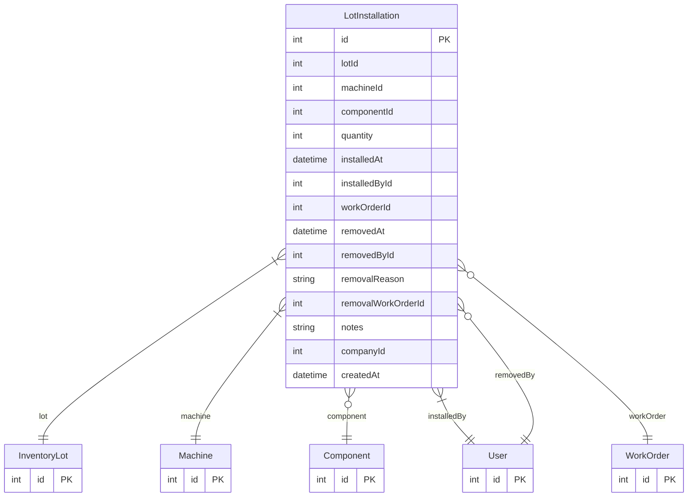

# LotInstallation

> Table name: `lot_installations`

**Schema location:** Lines 1480-1510

## Fields

| Field | Type | Required | Unique | Default | Notes |
|-------|------|----------|--------|---------|-------|
| `id` | `Int` | ✅ | 🔑 PK | `autoincrement(` |  |
| `lotId` | `Int` | ✅ |  | `` |  |
| `machineId` | `Int` | ✅ |  | `` |  |
| `componentId` | `Int?` | ❌ |  | `` |  |
| `quantity` | `Int` | ✅ |  | `1` |  |
| `installedAt` | `DateTime` | ✅ |  | `now(` |  |
| `installedById` | `Int` | ✅ |  | `` |  |
| `workOrderId` | `Int?` | ❌ |  | `` | OT en la que se instaló |
| `removedAt` | `DateTime?` | ❌ |  | `` | Retiro (si se reemplaza) |
| `removedById` | `Int?` | ❌ |  | `` |  |
| `removalReason` | `String?` | ❌ |  | `` | REPLACEMENT, FAILURE, UPGRADE, RELOCATION |
| `removalWorkOrderId` | `Int?` | ❌ |  | `` |  |
| `notes` | `String?` | ❌ |  | `` |  |
| `companyId` | `Int` | ✅ |  | `` |  |
| `createdAt` | `DateTime` | ✅ |  | `now(` |  |

## Relations

| Field | Type | Cardinality | FK Fields | References | On Delete |
|-------|------|-------------|-----------|------------|-----------|
| `lot` | [InventoryLot](./models/InventoryLot.md) | Many-to-One | lotId | id | Cascade |
| `machine` | [Machine](./models/Machine.md) | Many-to-One | machineId | id | Cascade |
| `component` | [Component](./models/Component.md) | Many-to-One (optional) | componentId | id | - |
| `installedBy` | [User](./models/User.md) | Many-to-One | installedById | id | - |
| `workOrder` | [WorkOrder](./models/WorkOrder.md) | Many-to-One (optional) | workOrderId | id | - |
| `removedBy` | [User](./models/User.md) | Many-to-One (optional) | removedById | id | - |

## Referenced By

| Model | Field | Cardinality |
|-------|-------|-------------|
| [User](./models/User.md) | `lotsInstalled` | Has many |
| [User](./models/User.md) | `lotsRemoved` | Has many |
| [Machine](./models/Machine.md) | `lotInstallations` | Has many |
| [Component](./models/Component.md) | `lotInstallations` | Has many |
| [InventoryLot](./models/InventoryLot.md) | `installations` | Has many |
| [WorkOrder](./models/WorkOrder.md) | `lotInstallations` | Has many |

## Indexes

- `machineId, removedAt`
- `lotId`
- `companyId`

## Entity Diagram

