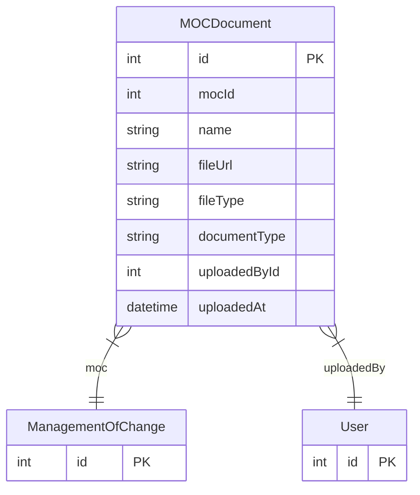

# MOCDocument

> Table name: `moc_documents`

**Schema location:** Lines 13370-13386

## Fields

| Field | Type | Required | Unique | Default | Notes |
|-------|------|----------|--------|---------|-------|
| `id` | `Int` | ✅ | 🔑 PK | `autoincrement(` |  |
| `mocId` | `Int` | ✅ |  | `` |  |
| `name` | `String` | ✅ |  | `` |  |
| `fileUrl` | `String` | ✅ |  | `` |  |
| `fileType` | `String?` | ❌ |  | `` |  |
| `documentType` | `String?` | ❌ |  | `` | BEFORE_PHOTO, AFTER_PHOTO, PROCEDURE, DRAWING, OTHER |
| `uploadedById` | `Int` | ✅ |  | `` |  |
| `uploadedAt` | `DateTime` | ✅ |  | `now(` |  |

## Relations

| Field | Type | Cardinality | FK Fields | References | On Delete |
|-------|------|-------------|-----------|------------|-----------|
| `moc` | [ManagementOfChange](./models/ManagementOfChange.md) | Many-to-One | mocId | id | Cascade |
| `uploadedBy` | [User](./models/User.md) | Many-to-One | uploadedById | id | - |

## Referenced By

| Model | Field | Cardinality |
|-------|-------|-------------|
| [User](./models/User.md) | `mocDocumentsUploaded` | Has many |
| [ManagementOfChange](./models/ManagementOfChange.md) | `documents` | Has many |

## Indexes

- `mocId`

## Entity Diagram

