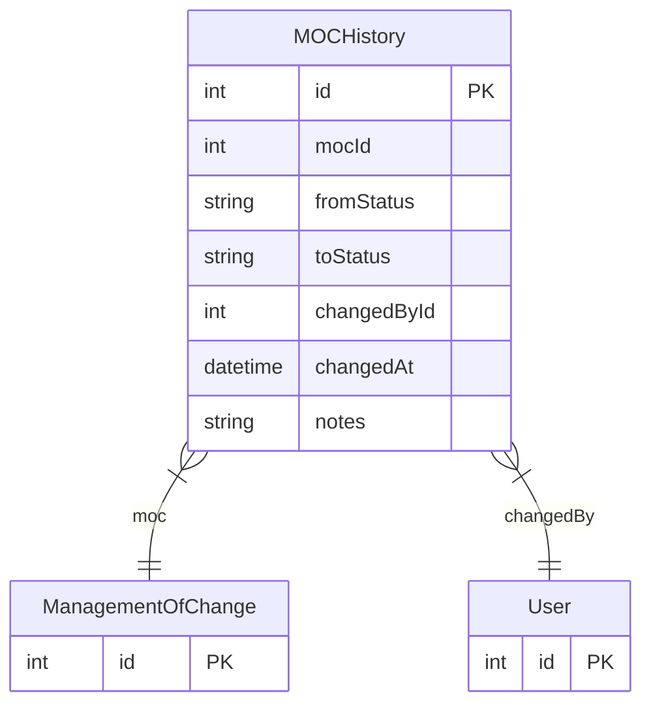

# MOCHistory

> Table name: `moc_history`

**Schema location:** Lines 13388-13403

## Fields

| Field | Type | Required | Unique | Default | Notes |
|-------|------|----------|--------|---------|-------|
| `id` | `Int` | ✅ | 🔑 PK | `autoincrement(` |  |
| `mocId` | `Int` | ✅ |  | `` |  |
| `fromStatus` | `String?` | ❌ |  | `` |  |
| `toStatus` | `String` | ✅ |  | `` |  |
| `changedById` | `Int` | ✅ |  | `` |  |
| `changedAt` | `DateTime` | ✅ |  | `now(` |  |
| `notes` | `String?` | ❌ |  | `` | DB: Text |

## Relations

| Field | Type | Cardinality | FK Fields | References | On Delete |
|-------|------|-------------|-----------|------------|-----------|
| `moc` | [ManagementOfChange](./models/ManagementOfChange.md) | Many-to-One | mocId | id | Cascade |
| `changedBy` | [User](./models/User.md) | Many-to-One | changedById | id | - |

## Referenced By

| Model | Field | Cardinality |
|-------|-------|-------------|
| [User](./models/User.md) | `mocHistoryChanges` | Has many |
| [ManagementOfChange](./models/ManagementOfChange.md) | `history` | Has many |

## Indexes

- `mocId`

## Entity Diagram

