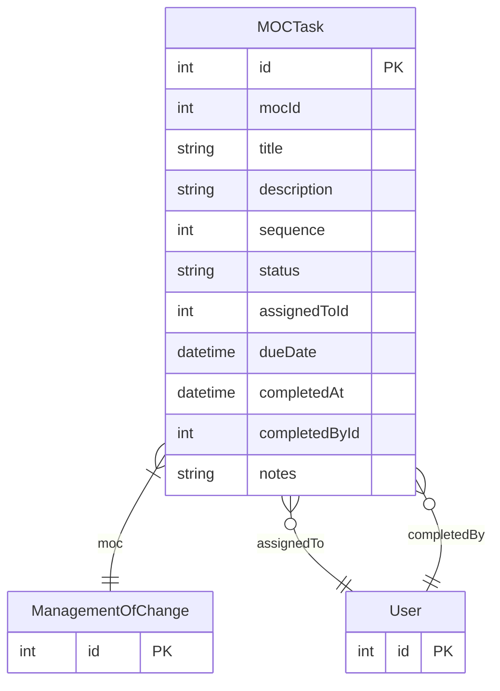

# MOCTask

> Table name: `moc_tasks`

**Schema location:** Lines 13405-13425

## Fields

| Field | Type | Required | Unique | Default | Notes |
|-------|------|----------|--------|---------|-------|
| `id` | `Int` | ✅ | 🔑 PK | `autoincrement(` |  |
| `mocId` | `Int` | ✅ |  | `` |  |
| `title` | `String` | ✅ |  | `` |  |
| `description` | `String?` | ❌ |  | `` | DB: Text |
| `sequence` | `Int` | ✅ |  | `0` |  |
| `status` | `String` | ✅ |  | `"PENDING"` | PENDING, IN_PROGRESS, COMPLETED, SKIPPED |
| `assignedToId` | `Int?` | ❌ |  | `` |  |
| `dueDate` | `DateTime?` | ❌ |  | `` |  |
| `completedAt` | `DateTime?` | ❌ |  | `` |  |
| `completedById` | `Int?` | ❌ |  | `` |  |
| `notes` | `String?` | ❌ |  | `` | DB: Text |

## Relations

| Field | Type | Cardinality | FK Fields | References | On Delete |
|-------|------|-------------|-----------|------------|-----------|
| `moc` | [ManagementOfChange](./models/ManagementOfChange.md) | Many-to-One | mocId | id | Cascade |
| `assignedTo` | [User](./models/User.md) | Many-to-One (optional) | assignedToId | id | - |
| `completedBy` | [User](./models/User.md) | Many-to-One (optional) | completedById | id | - |

## Referenced By

| Model | Field | Cardinality |
|-------|-------|-------------|
| [User](./models/User.md) | `mocTasksAssigned` | Has many |
| [User](./models/User.md) | `mocTasksCompleted` | Has many |
| [ManagementOfChange](./models/ManagementOfChange.md) | `tasks` | Has many |

## Indexes

- `mocId`

## Entity Diagram

