# Machine

> Table name: `Machine`

**Schema location:** Lines 933-1041

## Fields

| Field | Type | Required | Unique | Default | Notes |
|-------|------|----------|--------|---------|-------|
| `id` | `Int` | ✅ | 🔑 PK | `autoincrement(` |  |
| `name` | `String` | ✅ |  | `` |  |
| `nickname` | `String?` | ❌ |  | `` |  |
| `aliases` | `Json?` | ❌ |  | `` | Array de nombres alternativos ["caldera", "la caldera", "caldera de vapor"] |
| `brand` | `String?` | ❌ |  | `` |  |
| `model` | `String?` | ❌ |  | `` |  |
| `serialNumber` | `String?` | ❌ |  | `` |  |
| `description` | `String?` | ❌ |  | `` |  |
| `acquisitionDate` | `DateTime?` | ❌ |  | `` |  |
| `slug` | `String?` | ❌ |  | `` |  |
| `photo` | `String?` | ❌ |  | `` |  |
| `logo` | `String?` | ❌ |  | `` |  |
| `areaId` | `Int?` | ❌ |  | `` |  |
| `sectorId` | `Int?` | ❌ |  | `` |  |
| `plantZoneId` | `Int?` | ❌ |  | `` | Zona de planta a la que pertenece (opcional) |
| `companyId` | `Int` | ✅ |  | `` |  |
| `createdAt` | `DateTime` | ✅ |  | `now(` |  |
| `updatedAt` | `DateTime` | ✅ |  | `` |  |
| `assetCode` | `String?` | ❌ |  | `` | Código de activo interno |
| `sapCode` | `String?` | ❌ |  | `` | Código SAP |
| `productionLine` | `String?` | ❌ |  | `` | Línea de producción |
| `position` | `String?` | ❌ |  | `` | Posición dentro del sector/área |
| `manufacturingYear` | `Int?` | ❌ |  | `` | Año de fabricación |
| `installationDate` | `DateTime?` | ❌ |  | `` | Fecha de instalación |
| `technicalNotes` | `String?` | ❌ |  | `` | DB: Text. Notas técnicas |
| `power` | `String?` | ❌ |  | `` | Potencia (ej: "5 kW") |
| `voltage` | `String?` | ❌ |  | `` | Voltaje (ej: "220 V") |
| `weight` | `String?` | ❌ |  | `` | Peso (ej: "500 kg") |
| `dimensions` | `String?` | ❌ |  | `` | Dimensiones (ej: "2x3x1.5 m") |
| `maintenance_history` | `maintenance_history[]` | ✅ |  | `` |  |
| `criticalityScore` | `Int?` | ❌ |  | `` | Score total 1-10 (calculado) |
| `criticalityProduction` | `Int?` | ❌ |  | `` | Impacto en producción 1-10 |
| `criticalitySafety` | `Int?` | ❌ |  | `` | Impacto en seguridad 1-10 |
| `criticalityQuality` | `Int?` | ❌ |  | `` | Impacto en calidad 1-10 |
| `criticalityCost` | `Int?` | ❌ |  | `` | Impacto en costos 1-10 |
| `healthScore` | `Int?` | ❌ |  | `` | 0-100 (calculado automáticamente) |
| `healthScoreUpdatedAt` | `DateTime?` | ❌ |  | `` | Última actualización del health score |
| `ownerId` | `Int?` | ❌ |  | `` | Dueño del activo |
| `plannerId` | `Int?` | ❌ |  | `` | Planner asignado |
| `technicianId` | `Int?` | ❌ |  | `` | Técnico referente |

## Relations

| Field | Type | Cardinality | FK Fields | References | On Delete |
|-------|------|-------------|-----------|------------|-----------|
| `type` | [MachineType](./models/MachineType.md) | Many-to-One | - | - | - |
| `status` | [MachineStatus](./models/MachineStatus.md) | Many-to-One | - | - | - |
| `components` | [Component](./models/Component.md) | One-to-Many | - | - | - |
| `documents` | [Document](./models/Document.md) | One-to-Many | - | - | - |
| `historyEvents` | [HistoryEvent](./models/HistoryEvent.md) | One-to-Many | - | - | - |
| `area` | [Area](./models/Area.md) | Many-to-One (optional) | areaId | id | - |
| `company` | [Company](./models/Company.md) | Many-to-One | companyId | id | Cascade |
| `sector` | [Sector](./models/Sector.md) | Many-to-One (optional) | sectorId | id | - |
| `plantZone` | [PlantZone](./models/PlantZone.md) | Many-to-One (optional) | plantZoneId | id | - |
| `toolMachines` | [ToolMachine](./models/ToolMachine.md) | One-to-Many | - | - | - |
| `workStationMachines` | [WorkStationMachine](./models/WorkStationMachine.md) | One-to-Many | - | - | - |
| `failures` | [Failure](./models/Failure.md) | One-to-Many | - | - | - |
| `failureOccurrences` | [FailureOccurrence](./models/FailureOccurrence.md) | One-to-Many | - | - | - |
| `machineOrder` | [MachineOrder](./models/MachineOrder.md) | One-to-Many | - | - | - |
| `maintenanceChecklists` | [MaintenanceChecklist](./models/MaintenanceChecklist.md) | One-to-Many | - | - | - |
| `workOrders` | [WorkOrder](./models/WorkOrder.md) | One-to-Many | - | - | - |
| `downtimeLogs` | [DowntimeLog](./models/DowntimeLog.md) | One-to-Many | - | - | - |
| `ideas` | [Idea](./models/Idea.md) | One-to-Many | - | - | - |
| `lotInstallations` | [LotInstallation](./models/LotInstallation.md) | One-to-Many | - | - | - |
| `machineImportJob` | [MachineImportJob](./models/MachineImportJob.md) | Many-to-One (optional) | - | - | - |
| `lotoProcedures` | [LOTOProcedure](./models/LOTOProcedure.md) | One-to-Many | - | - | - |
| `permitsToWork` | [PermitToWork](./models/PermitToWork.md) | One-to-Many | - | - | - |
| `owner` | [User](./models/User.md) | Many-to-One (optional) | ownerId | id | - |
| `planner` | [User](./models/User.md) | Many-to-One (optional) | plannerId | id | - |
| `technician` | [User](./models/User.md) | Many-to-One (optional) | technicianId | id | - |
| `skillRequirements` | [TaskSkillRequirement](./models/TaskSkillRequirement.md) | One-to-Many | - | - | - |
| `counters` | [MachineCounter](./models/MachineCounter.md) | One-to-Many | - | - | - |
| `managementOfChanges` | [ManagementOfChange](./models/ManagementOfChange.md) | One-to-Many | - | - | - |
| `productionDowntimes` | [ProductionDowntime](./models/ProductionDowntime.md) | One-to-Many | - | - | - |
| `workCenters` | [WorkCenter](./models/WorkCenter.md) | One-to-Many | - | - | - |
| `serviceContracts` | [ServiceContract](./models/ServiceContract.md) | One-to-Many | - | - | - |

## Referenced By

| Model | Field | Cardinality |
|-------|-------|-------------|
| [Company](./models/Company.md) | `machines` | Has many |
| [User](./models/User.md) | `machinesOwned` | Has many |
| [User](./models/User.md) | `machinesPlanning` | Has many |
| [User](./models/User.md) | `machinesTechnical` | Has many |
| [Area](./models/Area.md) | `machines` | Has many |
| [Sector](./models/Sector.md) | `machines` | Has many |
| [PlantZone](./models/PlantZone.md) | `machines` | Has many |
| [MachineImportJob](./models/MachineImportJob.md) | `machine` | Has one |
| [Component](./models/Component.md) | `machine` | Has one |
| [ToolMachine](./models/ToolMachine.md) | `machine` | Has one |
| [LotInstallation](./models/LotInstallation.md) | `machine` | Has one |
| [WorkOrder](./models/WorkOrder.md) | `machine` | Has one |
| [Failure](./models/Failure.md) | `Machine` | Has one |
| [FailureOccurrence](./models/FailureOccurrence.md) | `machine` | Has one |
| [Document](./models/Document.md) | `machine` | Has one |
| [HistoryEvent](./models/HistoryEvent.md) | `machine` | Has one |
| [WorkStationMachine](./models/WorkStationMachine.md) | `machine` | Has one |
| [MaintenanceChecklist](./models/MaintenanceChecklist.md) | `machine` | Has one |
| [MachineOrder](./models/MachineOrder.md) | `machine` | Has one |
| [maintenance_history](./models/maintenance_history.md) | `Machine` | Has one |
| [DowntimeLog](./models/DowntimeLog.md) | `machine` | Has one |
| [Idea](./models/Idea.md) | `machine` | Has one |
| [LOTOProcedure](./models/LOTOProcedure.md) | `machine` | Has one |
| [PermitToWork](./models/PermitToWork.md) | `machine` | Has one |
| [TaskSkillRequirement](./models/TaskSkillRequirement.md) | `machine` | Has one |
| [MachineCounter](./models/MachineCounter.md) | `machine` | Has one |
| [ManagementOfChange](./models/ManagementOfChange.md) | `machine` | Has one |
| [WorkCenter](./models/WorkCenter.md) | `machine` | Has one |
| [ProductionDowntime](./models/ProductionDowntime.md) | `machine` | Has one |
| [ServiceContract](./models/ServiceContract.md) | `machine` | Has one |

## Indexes

- `companyId`
- `sectorId`
- `companyId, sectorId`
- `companyId, status`
- `areaId`
- `plantZoneId`
- `status`
- `healthScore`
- `criticalityScore`

## Entity Diagram

```mermaid
erDiagram
    Machine {
        int id PK
        string name
        string nickname
        json aliases
        string brand
        string model
        string serialNumber
        string description
        datetime acquisitionDate
        string slug
        string photo
        string logo
        int areaId
        int sectorId
        int plantZoneId
        string _more_fields
    }
    Component {
        int id PK
    }
    Document {
        int id PK
    }
    HistoryEvent {
        int id PK
    }
    Area {
        int id PK
    }
    Company {
        int id PK
    }
    Sector {
        int id PK
    }
    PlantZone {
        int id PK
    }
    ToolMachine {
        int id PK
    }
    WorkStationMachine {
        int id PK
    }
    Failure {
        int id PK
    }
    FailureOccurrence {
        int id PK
    }
    MachineOrder {
        int id PK
    }
    MaintenanceChecklist {
        int id PK
    }
    WorkOrder {
        int id PK
    }
    DowntimeLog {
        int id PK
    }
    Idea {
        int id PK
    }
    LotInstallation {
        int id PK
    }
    MachineImportJob {
        int id PK
    }
    LOTOProcedure {
        int id PK
    }
    PermitToWork {
        int id PK
    }
    User {
        int id PK
    }
    TaskSkillRequirement {
        int id PK
    }
    MachineCounter {
        int id PK
    }
    ManagementOfChange {
        int id PK
    }
    ProductionDowntime {
        int id PK
    }
    WorkCenter {
        int id PK
    }
    ServiceContract {
        int id PK
    }
    maintenance_history {
        int id PK
    }
    Machine }|--|| MachineType : "type"
    Machine }|--|| MachineStatus : "status"
    Machine ||--o{ Component : "components"
    Machine ||--o{ Document : "documents"
    Machine ||--o{ HistoryEvent : "historyEvents"
    Machine }o--|| Area : "area"
    Machine }|--|| Company : "company"
    Machine }o--|| Sector : "sector"
    Machine }o--|| PlantZone : "plantZone"
    Machine ||--o{ ToolMachine : "toolMachines"
    Machine ||--o{ WorkStationMachine : "workStationMachines"
    Machine ||--o{ Failure : "failures"
    Machine ||--o{ FailureOccurrence : "failureOccurrences"
    Machine ||--o{ MachineOrder : "machineOrder"
    Machine ||--o{ MaintenanceChecklist : "maintenanceChecklists"
    Machine ||--o{ WorkOrder : "workOrders"
    Machine ||--o{ DowntimeLog : "downtimeLogs"
    Machine ||--o{ Idea : "ideas"
    Machine ||--o{ LotInstallation : "lotInstallations"
    Machine }o--|| MachineImportJob : "machineImportJob"
    Machine ||--o{ LOTOProcedure : "lotoProcedures"
    Machine ||--o{ PermitToWork : "permitsToWork"
    Machine }o--|| User : "owner"
    Machine }o--|| User : "planner"
    Machine }o--|| User : "technician"
    Machine ||--o{ TaskSkillRequirement : "skillRequirements"
    Machine ||--o{ MachineCounter : "counters"
    Machine ||--o{ ManagementOfChange : "managementOfChanges"
    Machine ||--o{ ProductionDowntime : "productionDowntimes"
    Machine ||--o{ WorkCenter : "workCenters"
    Machine ||--o{ ServiceContract : "serviceContracts"
```

