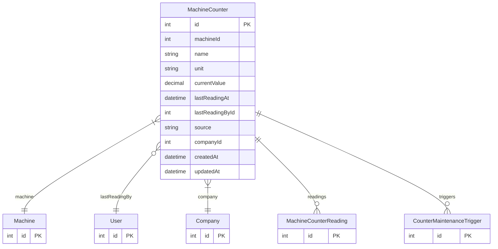

# MachineCounter

> Table name: `machine_counters`

**Schema location:** Lines 13212-13235

## Fields

| Field | Type | Required | Unique | Default | Notes |
|-------|------|----------|--------|---------|-------|
| `id` | `Int` | ✅ | 🔑 PK | `autoincrement(` |  |
| `machineId` | `Int` | ✅ |  | `` |  |
| `name` | `String` | ✅ |  | `` | "Horas de operación", "Ciclos", "Kilómetros" |
| `unit` | `String` | ✅ |  | `` | "horas", "ciclos", "km", "unidades" |
| `currentValue` | `Decimal` | ✅ |  | `0` |  |
| `lastReadingAt` | `DateTime?` | ❌ |  | `` |  |
| `lastReadingById` | `Int?` | ❌ |  | `` |  |
| `source` | `String` | ✅ |  | `"MANUAL"` | MANUAL, IOT, PLC |
| `companyId` | `Int` | ✅ |  | `` |  |
| `createdAt` | `DateTime` | ✅ |  | `now(` |  |
| `updatedAt` | `DateTime` | ✅ |  | `` |  |

## Relations

| Field | Type | Cardinality | FK Fields | References | On Delete |
|-------|------|-------------|-----------|------------|-----------|
| `machine` | [Machine](./models/Machine.md) | Many-to-One | machineId | id | Cascade |
| `lastReadingBy` | [User](./models/User.md) | Many-to-One (optional) | lastReadingById | id | - |
| `company` | [Company](./models/Company.md) | Many-to-One | companyId | id | Cascade |
| `readings` | [MachineCounterReading](./models/MachineCounterReading.md) | One-to-Many | - | - | - |
| `triggers` | [CounterMaintenanceTrigger](./models/CounterMaintenanceTrigger.md) | One-to-Many | - | - | - |

## Referenced By

| Model | Field | Cardinality |
|-------|-------|-------------|
| [Company](./models/Company.md) | `machineCounters` | Has many |
| [User](./models/User.md) | `counterLastReadings` | Has many |
| [Machine](./models/Machine.md) | `counters` | Has many |
| [MachineCounterReading](./models/MachineCounterReading.md) | `counter` | Has one |
| [CounterMaintenanceTrigger](./models/CounterMaintenanceTrigger.md) | `counter` | Has one |

## Indexes

- `machineId`
- `companyId`

## Entity Diagram

