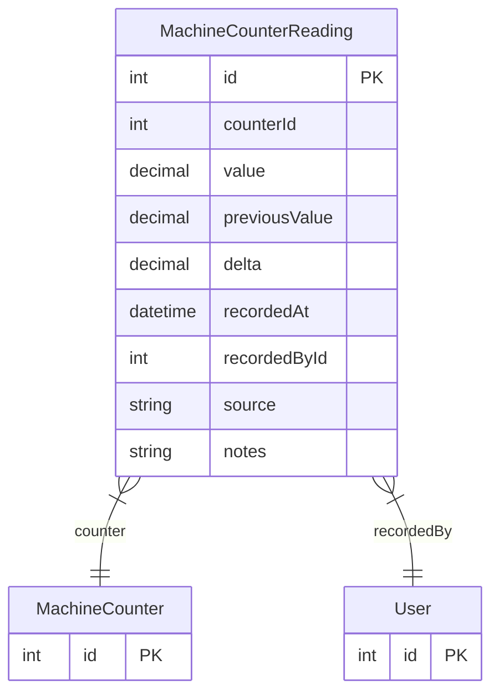

# MachineCounterReading

> Table name: `machine_counter_readings`

**Schema location:** Lines 13237-13255

## Fields

| Field | Type | Required | Unique | Default | Notes |
|-------|------|----------|--------|---------|-------|
| `id` | `Int` | ✅ | 🔑 PK | `autoincrement(` |  |
| `counterId` | `Int` | ✅ |  | `` |  |
| `value` | `Decimal` | ✅ |  | `` |  |
| `previousValue` | `Decimal?` | ❌ |  | `` |  |
| `delta` | `Decimal?` | ❌ |  | `` |  |
| `recordedAt` | `DateTime` | ✅ |  | `now(` |  |
| `recordedById` | `Int` | ✅ |  | `` |  |
| `source` | `String` | ✅ |  | `"MANUAL"` | MANUAL, IOT, PLC |
| `notes` | `String?` | ❌ |  | `` |  |

## Relations

| Field | Type | Cardinality | FK Fields | References | On Delete |
|-------|------|-------------|-----------|------------|-----------|
| `counter` | [MachineCounter](./models/MachineCounter.md) | Many-to-One | counterId | id | Cascade |
| `recordedBy` | [User](./models/User.md) | Many-to-One | recordedById | id | - |

## Referenced By

| Model | Field | Cardinality |
|-------|-------|-------------|
| [User](./models/User.md) | `counterReadings` | Has many |
| [MachineCounter](./models/MachineCounter.md) | `readings` | Has many |

## Indexes

- `counterId`
- `recordedAt`

## Entity Diagram

