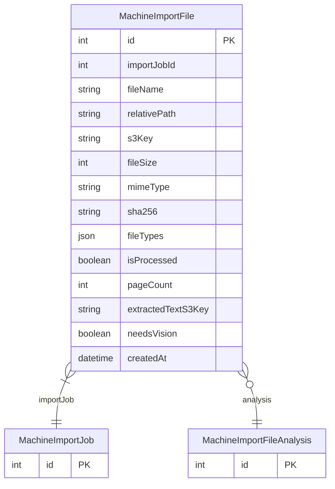

# MachineImportFile

> Table name: `machine_import_files`

**Schema location:** Lines 1104-1133

## Fields

| Field | Type | Required | Unique | Default | Notes |
|-------|------|----------|--------|---------|-------|
| `id` | `Int` | ✅ | 🔑 PK | `autoincrement(` |  |
| `importJobId` | `Int` | ✅ |  | `` |  |
| `fileName` | `String` | ✅ |  | `` | Archivo (NO guardamos URL, solo key) |
| `relativePath` | `String` | ✅ |  | `` |  |
| `s3Key` | `String` | ✅ |  | `` | SOLO key, URL se genera firmada |
| `fileSize` | `Int` | ✅ |  | `` |  |
| `mimeType` | `String` | ✅ |  | `` |  |
| `sha256` | `String` | ✅ |  | `` |  |
| `fileTypes` | `Json` | ✅ |  | `"[]"` | ["BLUEPRINT", "BOM"] |
| `isProcessed` | `Boolean` | ✅ |  | `false` | Procesamiento |
| `pageCount` | `Int?` | ❌ |  | `` |  |
| `extractedTextS3Key` | `String?` | ❌ |  | `` | texto extraído en S3, no en DB |
| `needsVision` | `Boolean` | ✅ |  | `false` | true si es escaneado |
| `createdAt` | `DateTime` | ✅ |  | `now(` |  |

## Relations

| Field | Type | Cardinality | FK Fields | References | On Delete |
|-------|------|-------------|-----------|------------|-----------|
| `importJob` | [MachineImportJob](./models/MachineImportJob.md) | Many-to-One | importJobId | id | Cascade |
| `analysis` | [MachineImportFileAnalysis](./models/MachineImportFileAnalysis.md) | Many-to-One (optional) | - | - | - |

## Referenced By

| Model | Field | Cardinality |
|-------|-------|-------------|
| [MachineImportJob](./models/MachineImportJob.md) | `files` | Has many |
| [MachineImportFileAnalysis](./models/MachineImportFileAnalysis.md) | `file` | Has one |

## Indexes

- `importJobId`
- `sha256`

## Entity Diagram

