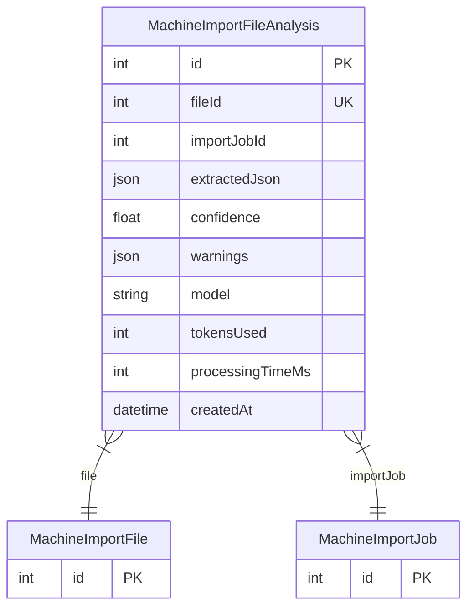

# MachineImportFileAnalysis

> Table name: `machine_import_file_analyses`

**Schema location:** Lines 1136-1157

## Fields

| Field | Type | Required | Unique | Default | Notes |
|-------|------|----------|--------|---------|-------|
| `id` | `Int` | ✅ | 🔑 PK | `autoincrement(` |  |
| `fileId` | `Int` | ✅ | ✅ | `` |  |
| `importJobId` | `Int` | ✅ |  | `` |  |
| `extractedJson` | `Json` | ✅ |  | `` | { machineInfo, components, rawEvidence } |
| `confidence` | `Float` | ✅ |  | `` | 0-1 |
| `warnings` | `Json` | ✅ |  | `"[]"` |  |
| `model` | `String?` | ❌ |  | `` | "gpt-4o" | "gpt-4o-mini" |
| `tokensUsed` | `Int?` | ❌ |  | `` |  |
| `processingTimeMs` | `Int?` | ❌ |  | `` |  |
| `createdAt` | `DateTime` | ✅ |  | `now(` |  |

## Relations

| Field | Type | Cardinality | FK Fields | References | On Delete |
|-------|------|-------------|-----------|------------|-----------|
| `file` | [MachineImportFile](./models/MachineImportFile.md) | Many-to-One | fileId | id | Cascade |
| `importJob` | [MachineImportJob](./models/MachineImportJob.md) | Many-to-One | importJobId | id | Cascade |

## Referenced By

| Model | Field | Cardinality |
|-------|-------|-------------|
| [MachineImportJob](./models/MachineImportJob.md) | `fileAnalyses` | Has many |
| [MachineImportFile](./models/MachineImportFile.md) | `analysis` | Has one |

## Indexes

- `importJobId`

## Entity Diagram

