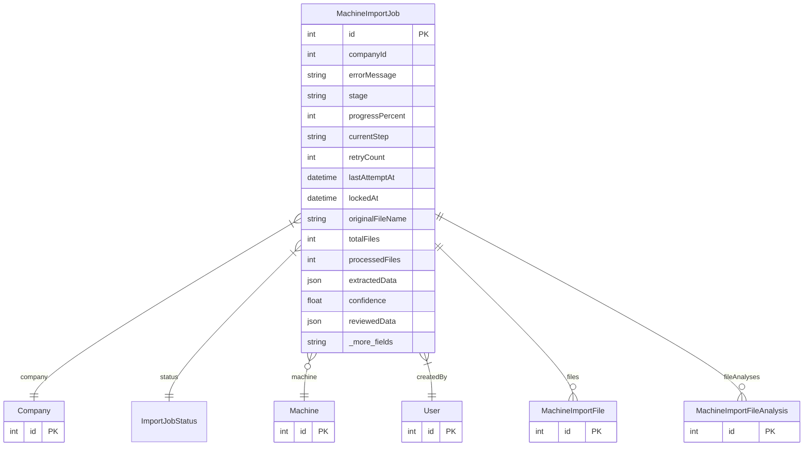

# MachineImportJob

> Table name: `machine_import_jobs`

**Schema location:** Lines 1047-1102

## Fields

| Field | Type | Required | Unique | Default | Notes |
|-------|------|----------|--------|---------|-------|
| `id` | `Int` | ✅ | 🔑 PK | `autoincrement(` |  |
| `companyId` | `Int` | ✅ |  | `` |  |
| `errorMessage` | `String?` | ❌ |  | `` |  |
| `stage` | `String?` | ❌ |  | `` | "uploading" | "extracting_file_3" | "merging" |
| `progressPercent` | `Int` | ✅ |  | `0` |  |
| `currentStep` | `String?` | ❌ |  | `` | descripción legible |
| `retryCount` | `Int` | ✅ |  | `0` | Retry |
| `lastAttemptAt` | `DateTime?` | ❌ |  | `` |  |
| `lockedAt` | `DateTime?` | ❌ |  | `` | para evitar doble procesamiento |
| `originalFileName` | `String?` | ❌ |  | `` | Archivos |
| `totalFiles` | `Int` | ✅ |  | `0` |  |
| `processedFiles` | `Int` | ✅ |  | `0` |  |
| `extractedData` | `Json?` | ❌ |  | `` | { machine, components, warnings, overallConfidence } |
| `confidence` | `Float?` | ❌ |  | `` | 0-1 (consistente) |
| `reviewedData` | `Json?` | ❌ |  | `` | Revisión del usuario |
| `translateEnabled` | `Boolean` | ✅ |  | `false` | Traducción |
| `sourceLanguage` | `String?` | ❌ |  | `` | 'auto' | 'en' | 'pt' | 'de' | 'fr' | 'it' | 'zh' | 'ja' | 'ko' |
| `targetLanguage` | `String?` | ❌ |  | `` | 'es' | 'en' | 'pt' |
| `machineId` | `Int?` | ❌ | ✅ | `` | Máquina creada |
| `createdById` | `Int` | ✅ |  | `` | Auditoría |
| `createdAt` | `DateTime` | ✅ |  | `now(` |  |
| `updatedAt` | `DateTime` | ✅ |  | `` |  |
| `completedAt` | `DateTime?` | ❌ |  | `` |  |

## Relations

| Field | Type | Cardinality | FK Fields | References | On Delete |
|-------|------|-------------|-----------|------------|-----------|
| `company` | [Company](./models/Company.md) | Many-to-One | companyId | id | - |
| `status` | [ImportJobStatus](./models/ImportJobStatus.md) | Many-to-One | - | - | - |
| `machine` | [Machine](./models/Machine.md) | Many-to-One (optional) | machineId | id | - |
| `createdBy` | [User](./models/User.md) | Many-to-One | createdById | id | - |
| `files` | [MachineImportFile](./models/MachineImportFile.md) | One-to-Many | - | - | - |
| `fileAnalyses` | [MachineImportFileAnalysis](./models/MachineImportFileAnalysis.md) | One-to-Many | - | - | - |

## Referenced By

| Model | Field | Cardinality |
|-------|-------|-------------|
| [Company](./models/Company.md) | `machineImportJobs` | Has many |
| [User](./models/User.md) | `machineImportsCreated` | Has many |
| [Machine](./models/Machine.md) | `machineImportJob` | Has one |
| [MachineImportFile](./models/MachineImportFile.md) | `importJob` | Has one |
| [MachineImportFileAnalysis](./models/MachineImportFileAnalysis.md) | `importJob` | Has one |

## Indexes

- `companyId`
- `status`
- `createdById`
- `lockedAt`

## Entity Diagram

