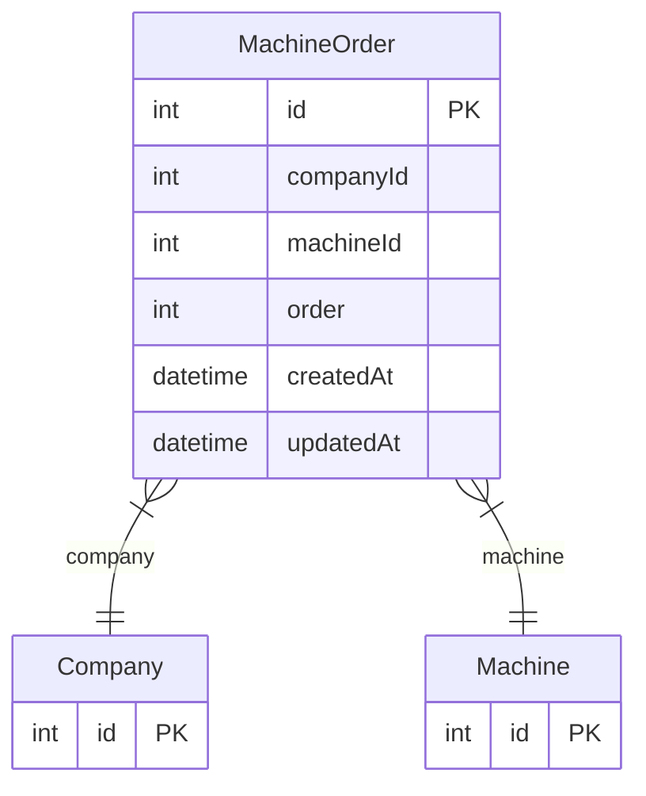

# MachineOrder

> Table name: `machine_order`

**Schema location:** Lines 3201-3213

## Fields

| Field | Type | Required | Unique | Default | Notes |
|-------|------|----------|--------|---------|-------|
| `id` | `Int` | ✅ | 🔑 PK | `autoincrement(` |  |
| `companyId` | `Int` | ✅ |  | `` |  |
| `machineId` | `Int` | ✅ |  | `` |  |
| `order` | `Int` | ✅ |  | `` |  |
| `createdAt` | `DateTime` | ✅ |  | `now(` |  |
| `updatedAt` | `DateTime` | ✅ |  | `` |  |

## Relations

| Field | Type | Cardinality | FK Fields | References | On Delete |
|-------|------|-------------|-----------|------------|-----------|
| `company` | [Company](./models/Company.md) | Many-to-One | companyId | id | Cascade |
| `machine` | [Machine](./models/Machine.md) | Many-to-One | machineId | id | Cascade |

## Referenced By

| Model | Field | Cardinality |
|-------|-------|-------------|
| [Company](./models/Company.md) | `machineOrder` | Has many |
| [Machine](./models/Machine.md) | `machineOrder` | Has many |

## Unique Constraints

- `companyId, machineId`

## Entity Diagram

