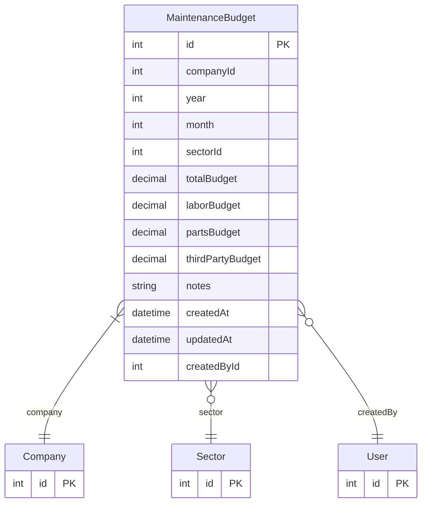

# MaintenanceBudget

> Table name: `maintenance_budgets`

**Schema location:** Lines 12439-12464

## Fields

| Field | Type | Required | Unique | Default | Notes |
|-------|------|----------|--------|---------|-------|
| `id` | `Int` | ✅ | 🔑 PK | `autoincrement(` |  |
| `companyId` | `Int` | ✅ |  | `` |  |
| `year` | `Int` | ✅ |  | `` |  |
| `month` | `Int?` | ❌ |  | `` | null = presupuesto anual |
| `sectorId` | `Int?` | ❌ |  | `` | null = toda la empresa |
| `totalBudget` | `Decimal` | ✅ |  | `` | DB: Decimal(14, 2) |
| `laborBudget` | `Decimal?` | ❌ |  | `` | DB: Decimal(14, 2) |
| `partsBudget` | `Decimal?` | ❌ |  | `` | DB: Decimal(14, 2) |
| `thirdPartyBudget` | `Decimal?` | ❌ |  | `` | DB: Decimal(14, 2) |
| `notes` | `String?` | ❌ |  | `` |  |
| `createdAt` | `DateTime` | ✅ |  | `now(` |  |
| `updatedAt` | `DateTime` | ✅ |  | `` |  |
| `createdById` | `Int?` | ❌ |  | `` |  |

## Relations

| Field | Type | Cardinality | FK Fields | References | On Delete |
|-------|------|-------------|-----------|------------|-----------|
| `company` | [Company](./models/Company.md) | Many-to-One | companyId | id | Cascade |
| `sector` | [Sector](./models/Sector.md) | Many-to-One (optional) | sectorId | id | - |
| `createdBy` | [User](./models/User.md) | Many-to-One (optional) | createdById | id | - |

## Referenced By

| Model | Field | Cardinality |
|-------|-------|-------------|
| [Company](./models/Company.md) | `maintenanceBudgets` | Has many |
| [User](./models/User.md) | `budgetsCreated` | Has many |
| [Sector](./models/Sector.md) | `maintenanceBudgets` | Has many |

## Indexes

- `companyId, year`

## Unique Constraints

- `companyId, year, month, sectorId`

## Entity Diagram

