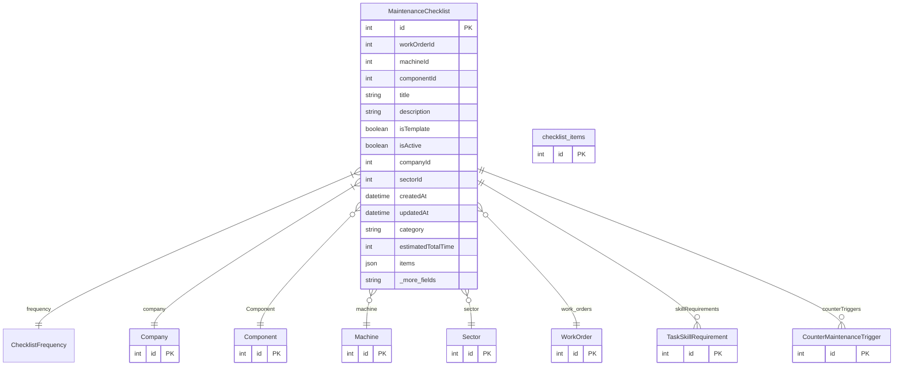

# MaintenanceChecklist

> Table name: `maintenance_checklists`

**Schema location:** Lines 3139-3176

## Fields

| Field | Type | Required | Unique | Default | Notes |
|-------|------|----------|--------|---------|-------|
| `id` | `Int` | ✅ | 🔑 PK | `autoincrement(` |  |
| `workOrderId` | `Int?` | ❌ |  | `` |  |
| `machineId` | `Int?` | ❌ |  | `` |  |
| `componentId` | `Int?` | ❌ |  | `` |  |
| `title` | `String` | ✅ |  | `` |  |
| `description` | `String?` | ❌ |  | `` |  |
| `isTemplate` | `Boolean` | ✅ |  | `false` |  |
| `isActive` | `Boolean` | ✅ |  | `true` |  |
| `companyId` | `Int` | ✅ |  | `` |  |
| `sectorId` | `Int?` | ❌ |  | `` |  |
| `createdAt` | `DateTime` | ✅ |  | `now(` |  |
| `updatedAt` | `DateTime` | ✅ |  | `` |  |
| `category` | `String?` | ❌ |  | `` |  |
| `estimatedTotalTime` | `Int?` | ❌ |  | `0` |  |
| `items` | `Json?` | ❌ |  | `` |  |
| `phases` | `Json?` | ❌ |  | `` |  |
| `instructives` | `Json?` | ❌ |  | `` |  |
| `checklist_items` | `checklist_items[]` | ✅ |  | `` |  |

## Relations

| Field | Type | Cardinality | FK Fields | References | On Delete |
|-------|------|-------------|-----------|------------|-----------|
| `frequency` | [ChecklistFrequency](./models/ChecklistFrequency.md) | Many-to-One | - | - | - |
| `company` | [Company](./models/Company.md) | Many-to-One | companyId | id | Cascade |
| `Component` | [Component](./models/Component.md) | Many-to-One (optional) | componentId | id | - |
| `machine` | [Machine](./models/Machine.md) | Many-to-One (optional) | machineId | id | - |
| `sector` | [Sector](./models/Sector.md) | Many-to-One (optional) | sectorId | id | - |
| `work_orders` | [WorkOrder](./models/WorkOrder.md) | Many-to-One (optional) | workOrderId | id | Cascade |
| `skillRequirements` | [TaskSkillRequirement](./models/TaskSkillRequirement.md) | One-to-Many | - | - | - |
| `counterTriggers` | [CounterMaintenanceTrigger](./models/CounterMaintenanceTrigger.md) | One-to-Many | - | - | - |

## Referenced By

| Model | Field | Cardinality |
|-------|-------|-------------|
| [Company](./models/Company.md) | `maintenanceChecklists` | Has many |
| [Sector](./models/Sector.md) | `maintenanceChecklists` | Has many |
| [Machine](./models/Machine.md) | `maintenanceChecklists` | Has many |
| [Component](./models/Component.md) | `maintenance_checklists` | Has many |
| [WorkOrder](./models/WorkOrder.md) | `maintenance_checklists` | Has many |
| [checklist_items](./models/checklist_items.md) | `maintenance_checklists` | Has one |
| [TaskSkillRequirement](./models/TaskSkillRequirement.md) | `checklist` | Has one |
| [CounterMaintenanceTrigger](./models/CounterMaintenanceTrigger.md) | `checklist` | Has one |

## Indexes

- `companyId, isActive`
- `companyId, sectorId, isActive`
- `sectorId`

## Entity Diagram

