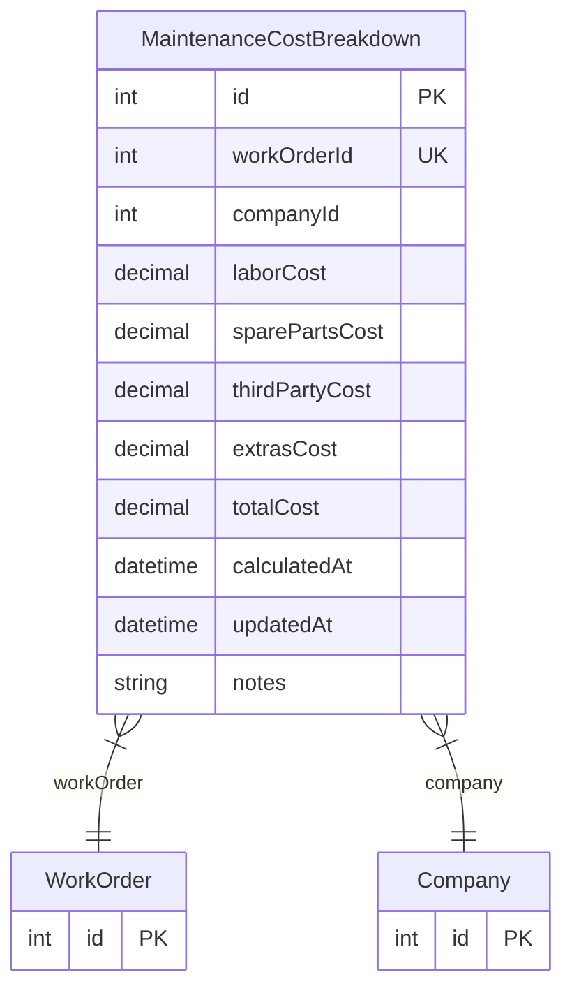

# MaintenanceCostBreakdown

> Table name: `maintenance_cost_breakdowns`

**Schema location:** Lines 12357-12381

## Fields

| Field | Type | Required | Unique | Default | Notes |
|-------|------|----------|--------|---------|-------|
| `id` | `Int` | ✅ | 🔑 PK | `autoincrement(` |  |
| `workOrderId` | `Int` | ✅ | ✅ | `` |  |
| `companyId` | `Int` | ✅ |  | `` |  |
| `laborCost` | `Decimal` | ✅ |  | `0` | DB: Decimal(12, 2). Mano de obra interna |
| `sparePartsCost` | `Decimal` | ✅ |  | `0` | DB: Decimal(12, 2). Repuestos usados |
| `thirdPartyCost` | `Decimal` | ✅ |  | `0` | DB: Decimal(12, 2). Servicios externos |
| `extrasCost` | `Decimal` | ✅ |  | `0` | DB: Decimal(12, 2). Otros costos |
| `totalCost` | `Decimal` | ✅ |  | `0` | DB: Decimal(12, 2). Total calculado |
| `calculatedAt` | `DateTime` | ✅ |  | `now(` | Metadata |
| `updatedAt` | `DateTime` | ✅ |  | `` |  |
| `notes` | `String?` | ❌ |  | `` |  |

## Relations

| Field | Type | Cardinality | FK Fields | References | On Delete |
|-------|------|-------------|-----------|------------|-----------|
| `workOrder` | [WorkOrder](./models/WorkOrder.md) | Many-to-One | workOrderId | id | Cascade |
| `company` | [Company](./models/Company.md) | Many-to-One | companyId | id | Cascade |

## Referenced By

| Model | Field | Cardinality |
|-------|-------|-------------|
| [Company](./models/Company.md) | `maintenanceCostBreakdowns` | Has many |
| [WorkOrder](./models/WorkOrder.md) | `costBreakdown` | Has one |

## Indexes

- `companyId`
- `calculatedAt`

## Entity Diagram

