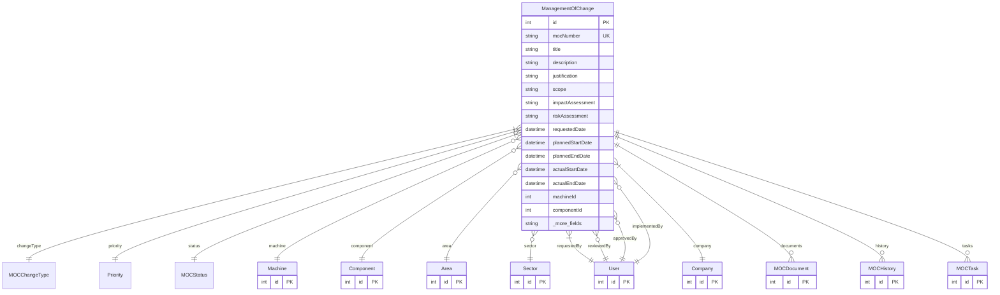

# ManagementOfChange

> Table name: `management_of_change`

**Schema location:** Lines 13300-13368

## Fields

| Field | Type | Required | Unique | Default | Notes |
|-------|------|----------|--------|---------|-------|
| `id` | `Int` | ✅ | 🔑 PK | `autoincrement(` |  |
| `mocNumber` | `String` | ✅ | ✅ | `` |  |
| `title` | `String` | ✅ |  | `` |  |
| `description` | `String` | ✅ |  | `` | DB: Text |
| `justification` | `String?` | ❌ |  | `` | DB: Text. Justificación y alcance |
| `scope` | `String?` | ❌ |  | `` | DB: Text |
| `impactAssessment` | `String?` | ❌ |  | `` | DB: Text |
| `riskAssessment` | `String?` | ❌ |  | `` | DB: Text |
| `requestedDate` | `DateTime` | ✅ |  | `now(` | Fechas |
| `plannedStartDate` | `DateTime?` | ❌ |  | `` |  |
| `plannedEndDate` | `DateTime?` | ❌ |  | `` |  |
| `actualStartDate` | `DateTime?` | ❌ |  | `` |  |
| `actualEndDate` | `DateTime?` | ❌ |  | `` |  |
| `machineId` | `Int?` | ❌ |  | `` | Entidades afectadas |
| `componentId` | `Int?` | ❌ |  | `` |  |
| `areaId` | `Int?` | ❌ |  | `` |  |
| `sectorId` | `Int?` | ❌ |  | `` |  |
| `requestedById` | `Int` | ✅ |  | `` | Usuarios |
| `reviewedById` | `Int?` | ❌ |  | `` |  |
| `approvedById` | `Int?` | ❌ |  | `` |  |
| `implementedById` | `Int?` | ❌ |  | `` |  |
| `approvalDate` | `DateTime?` | ❌ |  | `` | Aprobación |
| `approvalNotes` | `String?` | ❌ |  | `` | DB: Text |
| `rejectionReason` | `String?` | ❌ |  | `` | DB: Text |
| `isTemporary` | `Boolean` | ✅ |  | `false` | Metadatos |
| `temporaryUntil` | `DateTime?` | ❌ |  | `` |  |
| `requiresTraining` | `Boolean` | ✅ |  | `false` |  |
| `trainingCompleted` | `Boolean` | ✅ |  | `false` |  |
| `companyId` | `Int` | ✅ |  | `` |  |
| `createdAt` | `DateTime` | ✅ |  | `now(` |  |
| `updatedAt` | `DateTime` | ✅ |  | `` |  |

## Relations

| Field | Type | Cardinality | FK Fields | References | On Delete |
|-------|------|-------------|-----------|------------|-----------|
| `changeType` | [MOCChangeType](./models/MOCChangeType.md) | Many-to-One | - | - | - |
| `priority` | [Priority](./models/Priority.md) | Many-to-One | - | - | - |
| `status` | [MOCStatus](./models/MOCStatus.md) | Many-to-One | - | - | - |
| `machine` | [Machine](./models/Machine.md) | Many-to-One (optional) | machineId | id | - |
| `component` | [Component](./models/Component.md) | Many-to-One (optional) | componentId | id | - |
| `area` | [Area](./models/Area.md) | Many-to-One (optional) | areaId | id | - |
| `sector` | [Sector](./models/Sector.md) | Many-to-One (optional) | sectorId | id | - |
| `requestedBy` | [User](./models/User.md) | Many-to-One | requestedById | id | - |
| `reviewedBy` | [User](./models/User.md) | Many-to-One (optional) | reviewedById | id | - |
| `approvedBy` | [User](./models/User.md) | Many-to-One (optional) | approvedById | id | - |
| `implementedBy` | [User](./models/User.md) | Many-to-One (optional) | implementedById | id | - |
| `company` | [Company](./models/Company.md) | Many-to-One | companyId | id | Cascade |
| `documents` | [MOCDocument](./models/MOCDocument.md) | One-to-Many | - | - | - |
| `history` | [MOCHistory](./models/MOCHistory.md) | One-to-Many | - | - | - |
| `tasks` | [MOCTask](./models/MOCTask.md) | One-to-Many | - | - | - |

## Referenced By

| Model | Field | Cardinality |
|-------|-------|-------------|
| [Company](./models/Company.md) | `managementOfChanges` | Has many |
| [User](./models/User.md) | `mocRequested` | Has many |
| [User](./models/User.md) | `mocReviewed` | Has many |
| [User](./models/User.md) | `mocApproved` | Has many |
| [User](./models/User.md) | `mocImplemented` | Has many |
| [Area](./models/Area.md) | `managementOfChanges` | Has many |
| [Sector](./models/Sector.md) | `managementOfChanges` | Has many |
| [Machine](./models/Machine.md) | `managementOfChanges` | Has many |
| [Component](./models/Component.md) | `managementOfChanges` | Has many |
| [MOCDocument](./models/MOCDocument.md) | `moc` | Has one |
| [MOCHistory](./models/MOCHistory.md) | `moc` | Has one |
| [MOCTask](./models/MOCTask.md) | `moc` | Has one |

## Indexes

- `companyId, status`
- `machineId`
- `requestedById`

## Entity Diagram

